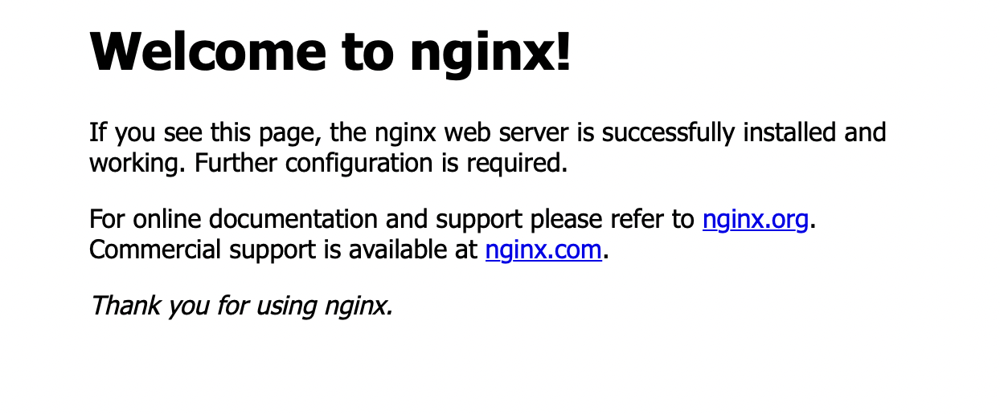
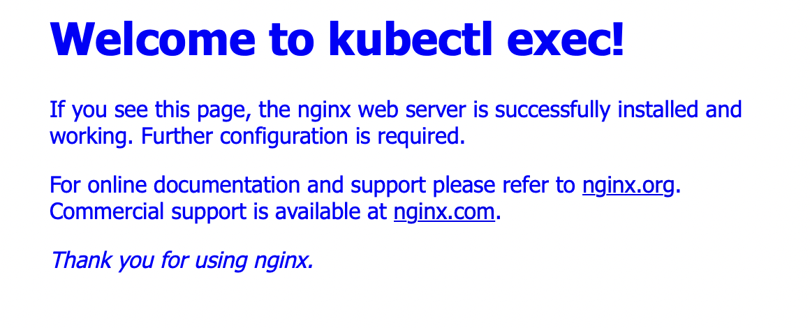

I recently learned about `kubectl port-forward` and `kubectl exec`, and I was amazed by what simple but cool stuff you could o with just these two commands when getting started with Kubernetes. So that's what this post is going to be about.

## Running Our Pod

I'm going to use `minikube` to launch my cluster but feel free to use whatever you like. Once you have your cluster up and running (using `minikube start`), create a nginx pod using:
```
kubectl run my-nginx --image=nginx:alpine
```
You can confirm your pod is running successfully by running `kubectl get pods` and seeing the `STATUS` column.

## kubectl port-forward
Nginx runs on port 80 inside a container. But if you try to go to `localhost:80` (or simply `localhost` since `80` is the default port) you will not see anything. 

This is expected because we never exposed an external port by which we can reach the Nginx container. We need to kind of *poke a hole* into our k8s cluster to expose a port that we can call in the browser which then calls into our Nginx container in the pod. 

This is where `kubectl port-forward` will help us. Run
```
kubectl port-forward my-nginx 8080:80
```
A bit of explanation: 
- `my-nginx` is simply the pod name.
- `8080` is the external port we want to use (you can use any other available port here)
- `80` is the port we know Nginx runs on inside the pod (in that pod's container).

Now go to `localhost:8080` and you'll see the default Nginx starter page! 😁



We needed to do the `port-forward` because the IP address the pod is being assigned inside the cluster is not accessible by default, and it is the port forward which makes it so.

> Your console would be locked after running that command and you can unlock it by pressing `ctrl+C`.


## kubectl exec

Now we're gonna mess with the Nginx default home page you just saw 😈

Our pod is running a container that is based on the Nginx image. Nginx serves its default page from the `index.html` file which is located in `/usr/share/nginx/html` directory of the container. 

We will edit this file by using `kubectl exec` which will provide us with a shell inside the running container.

We will also be using the `-i` and `-t` flags with it. 

These two flags combined (`-it`) allow us to execute commands inside the container but from our own terminal. This means if you running something like `ls` you will see the files in the container and not on your system where the terminal is actually running. You can read more about them [here](https://stackoverflow.com/questions/22272401/what-does-it-mean-to-attach-a-tty-std-in-out-to-dockers-or-lxc).

You can also learn more about the flags it supports [here](https://kubernetes.io/docs/reference/generated/kubectl/kubectl-commands#exec).

With that out of the way run the following command:
```
kubectl exec my-nginx -it sh
```
`sh` is the first command we run inside our container. It is the command name of the [Bourne shell](https://superuser.com/a/97617).

This should now give us access to a shell inside our container which is running Nginx. Let us now navigate to the folder containing our `index.html` file:

```
cd /usr/share/nginx/html
```

Type `ls` here and you'll see the following files:
```
50x.html index.html
```

Let us now edit our `index.html` file using vim. Run:
```
vi index.html
```
Press `i` to enter the insert mode in vim which will allow you to make changes to the file. Navigate to the `style` block and inside body add the following CSS:
```
color: blue;
```
Then go down below and replace the "Welcome to nginx!" written in the `h1` tags with anything you'd like. Once you're done making changes press `esc` to leave this editing mode. 

Type `:wq` (write and quit) and press enter to save this file. Type `exit` to leave this shell inside our container and return to your original shell. Now let's run the port-forward command:
```
kubectl port-forward my-nginx 8080:80
```
and visit `localhost:8080`. You should now see your changes in effect :)



And this was it for this post! I was pretty amazed when I learned to do this with just these two simple `kubectl` subcommands. I always find doing something to see the commands in practice much more useful than simply reading about them so I thought of sharing this with you all. I hope you found this post interesting. Thanks for reading! :D