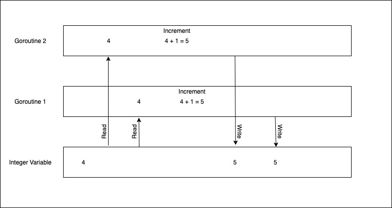

This post is the second in my series of articles on [Concurrency in Go](https://arshsharma.com/posts/2021-05-19-concurrency-in-golang/). In this post, we'll understand what a race condition is, the why and how of it, and finally, we see some code that creates a race condition, and then we will learn to fix that race condition with the help of Mutexes. So let's get started!

## The What, Why And How Of A Race Condition

A race condition in Go occurs when two or more goroutines have shared data and interact with it at the same time. This is best explained with the help of an example. 

Let us say two functions that increment an integer by 1 are launched in two separate goroutines and act on the same variable. Now if they were executed sequentially then the initial integer would have increased by 2. But now that they are in a race condition this can't be guaranteed. Why you may ask?

Each function basically has three tasks:
1. Read from the variable
2. Increment it
3. Write back to it

So let's say that function 1 reads the variable. But before it increments and writes it back function 2 also reads the variable. Both of them now increment the variable and write it back. But the value of the variable would have increased by only 1 since both functions initially read the same value. The following image should make it even more clear.



Please note that this is only one of the possible scenarios. It might just happen that the second goroutine reads the variable after the first one has already incremented and written back to it. In this case, the value would have increased by two. So when there is a race condition the final output is not fixed and can vary each time you run the program.

I think it should also go without saying that we cannot have a race condition if we only have a single goroutine.

So now that you have an idea about what race conditions are, let us go and see them in action!

## Coding Our Race Condition

Copy the following code in your `main.go` file and then we'll walk through it.

```
package main

import (
	"fmt"
	"runtime"
	"sync"
)

func main() {

	counter := 0

	const num = 15
	var wg sync.WaitGroup
	wg.Add(num)

	for i := 0; i < num; i++ {
		go func() {
			temp := counter
			runtime.Gosched()
			temp++
			counter = temp
			wg.Done()
		}()
	}
	wg.Wait()
	fmt.Println("count:", counter)
}
```

We declare a variable `counter` which is what all our goroutines will try to modify simultaneously. Then we launch 15 anonymous self-executing functions in their separate goroutines. Each of these functions reads the value from `counter`, increments it, and then writes it back. Apart from all this we also use a [WaitGroup](https://arshs.tech/concurrency-in-golang/) which I explained in detail in the previous article. This explains everything apart from `runtime.Gosched()`.

Before I explain what that does, comment that line and run the code a few times. You will see that each time the output is 15. This should not be the case given there is a race condition. Let's see something even more interesting. Change the initial value of num to 100 and now run it multiple times. This time you'll see that different values appear but they're still close to 100 and not much apart. Next, change this value to 1000 and run it multiple times you should now start seeing even greater differences in the values you are getting. Now uncomment the line and repeat the steps with num as 15, 100, and 1000. If you did everything correctly now you should see a different value each time in all three cases and the values would be much farther apart than before.

> Please note that you should not try this on some online IDE as they are not suitable for running multiple goroutines simultaneously.

So what is happening?!

Well, obviously this was a race condition because we saw different values for 100 and 1000. But what did `runtime.Gosched()` do? The thing is that Go tries to avoid these race conditions on its own and succeeds when the number is relatively small like 15 but has a tough time keeping up as we increase the number. Go uses something called [cooperative multithreading](http://www.cafeaulait.org/course/week11/32.html). If you read the link it says,

"In cooperative models, once a thread is given control it continues to run until it explicitly yields control or it blocks."

[This answer](https://stackoverflow.com/a/13108469) also provides much more clarity. To put it in extremely simple terms, `runtime.Gosched()` basically says go ahead and run some other goroutine if you want. In other words, it yields the processor allowing other goroutines to run. It basically sorta increases the randomness so that the probability of goroutines interfering with each other and reading-writing in different order increases. 

> Note that you can also confirm the existence of a race condition by executing the program with the `race` flag: `go run -race main.go`

## Fixing Our Race Condition

Now that we've created a race condition, how do we fix it? We will be using a `Mutex` to prevent the race condition. We know the data race occurs due to multiple goroutines accessing a shared variable. We can prevent this by sorta locking access to our `counter` variable when one of the goroutines reads it and then unlocking it when it is done writing the incremented value. This way nobody else can use that variable when a particular goroutine is updating it. This is exactly what [Mutex](https://golang.org/pkg/sync/#Mutex) does.

With the above explanation I think you'll now be able to make sense of the following update we made to our code:

```
	const num = 15
	var wg sync.WaitGroup
	wg.Add(num)

	var mu sync.Mutex

	for i := 0; i < num; i++ {
		go func() {
			mu.Lock()
			temp := counter
			runtime.Gosched()
			temp++
			counter = temp
			mu.Unlock()
			wg.Done()
		}()
	}
	wg.Wait()
```

Run `go run -race main.go` and you'll see that no race condition gets reported this time! And since there are no race conditions now the value of `counter` will also be 15 each time.

I hope this made a bit more sense. This is something I struggled to wrap my head around myself so I can say from experience that you'll need to think about it for some time and go read some other sources also including the [official docs](https://golang.org/pkg/runtime/#Gosched). Stay tuned for the next article!

Thank you for reading! :)