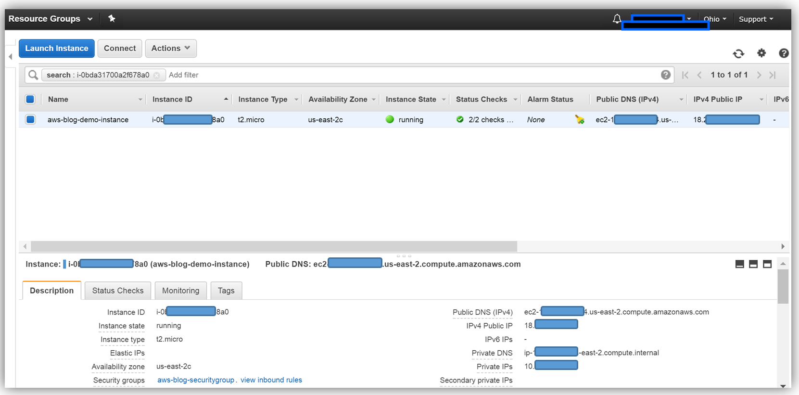
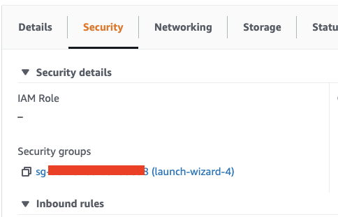
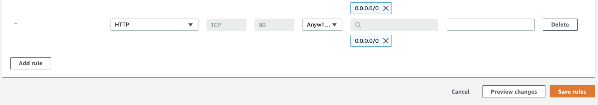
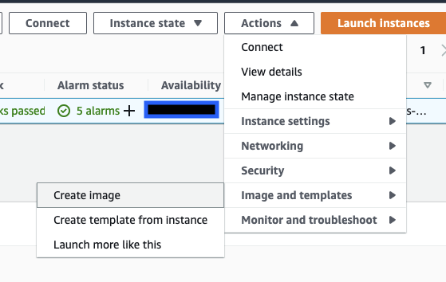

In the [previous post](/posts/2021-10-02-introduction-to-aws-iaas/), we talked briefly about EC2. In this post, we'll explore it in a bit more detail. We'll launch an instance and use it to run an nginx web server which will be accessible from anywhere using a URL. So without further ado, let's get started :)


Search for "EC2" in the AWS search bar. From there click the "Launch Instance" button. Now you would see a screen to choose an AMI. AMIs (Amazon Machine Images) are nothing but virtual machine images. For this blog, we're going to select the "Amazon Linux 2 AMI (HVM), SSD Volume Type" with the x86 option. On the "Instance Type" screen we select the kind of hardware we want to be allocated to our VM. This is basically like choosing the configuration (CPU, RAM, etc) for our computer which would act as the server. Let's go with "t2.micro" here. From here click on "Review and Launch" and finally on the next screen click on "Launch". 

Now to connect to this instance through SSH we'll need to create a key pair that acts sort of like a password to access this instance. In the first pulldown on the popup, you see click on "Create a new key pair" and let's keep the name as "ec2demo". Then click the "Download Key Pair" button and finally click the "Launch Instances" button.  On the next screen, click on "View Instances". 

Once you confirm that the "Instance state" is "Running", click on the checkbox in the first column for this instance and then click on "Connect" in the top bar. Go to the "SSH client" and if you follow the instructions there you should have SSH access to your instance. 

What this basically did was use the encoded private key we downloaded to connect via SSH to the instance which already had the associated public key installed. 

Now let's install nginx on this machine. nginx is available from the AWS "Extras Repository". You can confirm this by running

```
amazon-linux-extras list | grep nginx
```

To install it run 
```
sudo amazon-linux-extras install nginx1
```

We can verify that it was installed successfully by running 

```
nginx -v
```
Let us start the webserver by running 

```
sudo service nginx start
```

You can also confirm that it's running using 
```
sudo service nginx status
```

Once the server is up let's also confirm that we can see the nginx starter page from within this EC2 instance. 

```
curl localhost
```

This should show you the HTML for the nginx starter page. 

Alrighty, now that we have our EC2 instance all set up let's head back to the AWS console. If you select we instance we'll see information related to it on the bottom of our screen as shown in the below image.





The "Public IPv4 DNS" is the URL we can use to see the nginx starter page from any machine. So let's click on that and see what happens. 

Not what you expected right? :)

So why can't we access this URL? 

If you've run servers before you'd know that allowing unfiltered internet traffic to your server means exposing it to so many security threats. Amazon uses security groups to solve this. These act as firewalls that allow us to expose only the parts of our server that are configured for public internet traffic. 

Since we didn't configure our security groups while launching the EC2 instance Amazon assigned the standard security group to it. Click on the "Security" tab next to "Details" and then click on the link under "Security groups". 



On the next screen, you will see one inbound and one outbound rule. The outbound rule allows our EC2 instance to communicate with anything on the internet. The inbound rule on the other hand says that anyone can connect to our instance using SSH. Click on the "Edit inbound rules" button to add another inbound rule. 

We'll add a rule to allow HTTP traffic from anywhere to our EC2 instance. Add the rule shown below and then click on "Save rules". 



After doing this if you go to the previous URL you should see the nginx starter page :)


> Please note that you should navigate to `http://<url>` and not `https://<url>`.

Before we wrap up I want to show you one last thing. Just like we used the "Amazon Linux 2 AMI (HVM), SSD Volume Type" AMI for this EC2 instance, you can create an AMI from this instance. This would mean when you launch another instance using this created AMI you wouldn't have to install nginx again. To do this select your instance and go to Actions > Image and templates > Create image. Just add an image name and leave everything else to its default values. Now once the AMI is ready and you navigate to the AMIs section using the nav menu on the left you should be able to launch an instance using this image.





So this was it for this article and I hope you now feel familiar enough with EC2 instances to go and play with them yourselves. Thanks for reading and like always please feel free to [reach out](https://arshsharma.com/) to me if you have any feedback or doubts :)