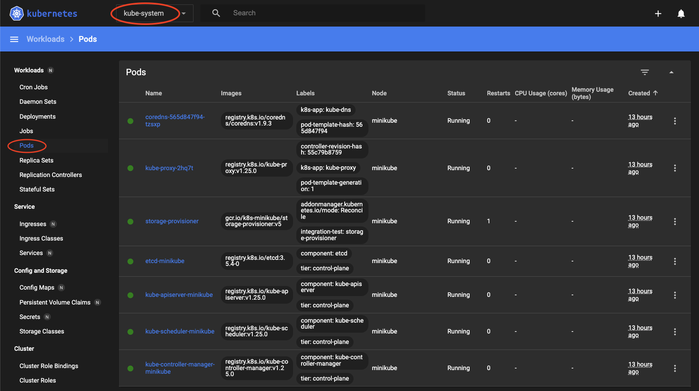

Rushing to a cloud provider and spinning up a remote cluster every time you want to try something out with Kubernetes isn’t always convenient - nor is it economical. [minikube](https://minikube.sigs.k8s.io/docs/) provides a way to run Kubernetes clusters locally so that you learn and play around with K8s. It is an excellent way to test things out before working with an actual cluster in the cloud. 

In this article, we’re going to launch a minikube cluster and see all the interesting features minikube has to offer. If you’re new to the Kubernetes world, I recommend checking out my [Kubernetes for Beginners](https://dev.to/rinkiyakedad/series/16643) series before proceeding with this article. 

## Getting Started With minikube

Installing minikube is fairly simple. If you’re on macOS, you can simply install it via [Homebrew](https://brew.sh/) by running the following:

```bash
brew install minikube
```

Detailed install instructions for other platforms can be found in their [documentation](https://minikube.sigs.k8s.io/docs/start/). 

Once you have minikube installed, you can spin up your local Kubernetes cluster by running:

```bash
minikube start 
```

Just make sure your [Docker daemon](https://docs.docker.com/get-started/overview/#the-docker-daemon) is running before starting minikube. By default, minikube starts a single node Kubernetes cluster, and you can confirm this by running:

```bash
$ kubectl get nodes
NAME       STATUS   ROLES           AGE   VERSION
minikube   Ready    control-plane   31d   v1.25.0
```

A fun fact is that you can choose which version of Kubernetes you want to use for the cluster. The `-kubernetes-version` flag allows you to specify any of the **latest six versions** of Kubernetes.

```bash
$ minikube start --kubernetes-version=v1.16.0
```

This is very helpful if you want to test the compatibility of your application before upgrading your production cluster. 

Now that we have our cluster up and running let me share some helpful minikube tips and tricks.

## Working Simultaneously with Multiple Clusters

We just learned how you can launch local clusters with different versions of Kubernetes with minikube. But if you’re trying things out between multiple versions, you’d likely want to spin up multiple clusters as well. The good thing is that minikube allows you to do this easily using `profiles`.

You can start a new cluster by specifying a different profile name:

```bash
$ minikube start --profile new-profile --kubernetes-version=v1.23.0
```

Once the cluster is up, your `kubectl` will automatically be configured to work with it. You can confirm this by getting the nodes:

```bash
$ kubectl get nodes
NAME          STATUS   ROLES           AGE   VERSION
new-profile   Ready    control-plane   67s   **v1.23.0**
```

The previous cluster we had launched was with the default profile called `minikube`. You can switch between clusters by changing minikube’s active profile using the `minikube profile` subcommand:

```bash
$ minikube profile minikube
```

If you get the nodes now, you’ll see that we did indeed switch clusters:

```bash
$ kubectl get nodes
NAME       STATUS   ROLES           AGE     VERSION
minikube   Ready    control-plane   4h46m   **v1.25.0**
```

## The Kubernetes Dashboard

minikube also provides a convenient way to access the [Kubernetes Dashboard](https://kubernetes.io/docs/tasks/access-application-cluster/web-ui-dashboard/). For those of you not familiar, the K8s dashboard allows you to monitor the health of the cluster and gives an overview of the applications running on your cluster. You can access this dashboard by running:

```bash
$ minikube dashboard
```

If you switch to the `kube-system` namespace and view all the pods in it, you should see the default pods K8s has running:



I’ve seen a lot of people just assume that the dashboard won’t be available with minikube since it’s not an actual “cluster in the cloud,” but that’s just simply not true :)

## Logging Into minikube For Debugging

Just like with an actual cluster, sometimes you might want to ssh into the node of your minikube cluster to debug things. minikube provides a convenient way to do that as well:

```bash
$ minikube ssh
Last login: Thu Oct 30 05:33:02 2022 from 191.169.46.5
docker@minikube:~$
```

Once you’re in the node, you can run `ps aux | grep apiserver` to confirm that you are, in fact, in the node by seeing the `apiserver` process running:

```bash
docker@minikube:~$ ps aux | grep apiserver
root        1496  8.8 15.5 1108456 317600 ?      Ssl  04:33   6:29 kube-apiserver --advertise-address=192.168.49.2 --allow-privileged=true --authorization-mode=Node,RBAC --client-ca-file=/var/lib/minikube/certs/ca.crt --enable-admission-plugins=NamespaceLifecycle,LimitRanger,ServiceAccount,DefaultStorageClass,DefaultTolerationSeconds,NodeRestriction,MutatingAdmissionWebhook,ValidatingAdmissionWebhook,ResourceQuota --enable-bootstrap-token-auth=true --etcd-cafile=/var/lib/minikube/certs/etcd/ca.crt --etcd-certfile=/var/lib/minikube/certs/apiserver-etcd-client.crt --etcd-keyfile=/var/lib/minikube/certs/apiserver-etcd-client.key --etcd-servers=https://127.0.0.1:2379 --kubelet-client-certificate=/var/lib/minikube/certs/apiserver-kubelet-client.crt --kubelet-client-key=/var/lib/minikube/certs/apiserver-kubelet-client.key --kubelet-preferred-address-types=InternalIP,ExternalIP,Hostname --proxy-client-cert-file=/var/lib/minikube/certs/front-proxy-client.crt --proxy-client-key-file=/var/lib/minikube/certs/front-proxy-client.key --requestheader-allowed-names=front-proxy-client --requestheader-client-ca-file=/var/lib/minikube/certs/front-proxy-ca.crt --requestheader-extra-headers-prefix=X-Remote-Extra- --requestheader-group-headers=X-Remote-Group --requestheader-username-headers=X-Remote-User --secure-port=8443 --service-account-issuer=https://kubernetes.default.svc.cluster.local --service-account-key-file=/var/lib/minikube/certs/sa.pub --service-account-signing-key-file=/var/lib/minikube/certs/sa.key --service-cluster-ip-range=10.96.0.0/12 --tls-cert-file=/var/lib/minikube/certs/apiserver.crt --tls-private-key-file=/var/lib/minikube/certs/apiserver.key
docker     40268  0.0  0.0   2976   660 pts/1    S+   05:47   0:00 grep --color=auto apiserver
```

## Sending Files To The minikube Node

Did you know that any files you put on your local machine at `$HOME/.minikube/files` get transferred to the minikube node’s filesystem when you launch your cluster? Let’s confirm it for ourselves by seeing it in action!

First, let’s create a file on our local machine:

```bash
$ echo "hello from arsh" > $HOME/.minikube/files/arsh
```

Now restart your minikube cluster so that it picks up the new file we just created:

```bash
$ minikube stop
$ minikube start
```

Once the cluster is up, ssh into the node and change the directory to root:

```bash
$ minikube ssh
$ docker@minikube:~$ cd /
```

You’ll see the file we just created along with its contents here!

```bash
docker@minikube:/$ cat arsh
hello from arsh
```

## Conclusion

Migrating your applications to Kubernetes can be a daunting task. However, using tools like minikube can help you mitigate the risks and prepare you before making the final shift. I hope this article has been informative and has helped you learn new things about minikube. By using minikube, you can gain confidence in your Kubernetes skills and be better prepared for managing your production clusters.