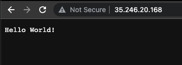

I have [written](https://dev.to/rinkiyakedad/series/16643) extensively about different Kubernetes concepts in my previous blogs, but I haven't covered a proper, step-by-step hands-on guide for getting started with Kubernetes. In this article, my plan is to do exactly that. After all, there's only so much you can learn by reading without trying things out yourself.

We will take a simple microservice-based application, containerize it, and deploy it to a Kubernetes cluster. I will be using [Google Cloud](https://cloud.google.com/) for this, but you can use any cloud provider to follow along. Without wasting any more words, let's get started!

## The Application

I want to focus on the concepts of containerization and Kubernetes in this article, so to keep things easy to follow, we will work with a very simple Go server. Even if you've never worked with Go, the code should be pretty simple to understand.

```go
// main.go

package main

import (
	"fmt"
	"log"
	"net/http"
)

func main() {
	http.HandleFunc("/", func(w http.ResponseWriter, r *http.Request) {
		fmt.Fprintf(w, "Hello, World!")
	})

	fmt.Printf("Starting server at port 4000\n")
	if err := http.ListenAndServe(":4000", nil); err != nil {
		log.Fatal(err)
	}
}
```

If you want to run this application locally, you first have to build the binary and then run it.

```bash
$ go mod init simple-go-server
$ go build
$ ./simple-go-server
```

Then, when you visit [localhost:4000](http://localhost:4000), you should see the text "Hello, World!" Pretty simple, right?


Now let's work on containerizing this Go service.

## Containerizing Our Application

Kubernetes does not run applications directly. You cannot simply instruct it to build the binary and start serving the application. Instead, it is a tool for running and managing containers (in fact, it doesn't run containers directly, but more on that later). Therefore, we need to containerize our application before we can proceed to running it on a Kubernetes cluster.

> If you are not familiar with containers and Dockerfiles, I recommend checking out my [article series](https://dev.to/rinkiyakedad/series/10009) on Docker before proceeding.

Let's write a Dockerfile for our application. At the root folder of the application, create the following file:

```dockerfile
# Dockerfile

FROM golang:buster

WORKDIR /app
ADD . .
RUN go build -o /usr/local/bin/simple-go-server

EXPOSE 4000
CMD ["/usr/local/bin/simple-go-server"]
```

Assuming you have some familiarity with [Dockerfiles](https://dev.to/rinkiyakedad/learning-to-use-docker-298b#dockerfile), this one should be fairly easy to understand. We use a `golang` base image to ensure that Go and all required dependencies are present in our container from the start.

After setting the working directory, we move our application's code (the `main.go` file in this case) to this location. We then execute the `go build` command to build the binary from our code and output it at `/usr/local/bin/simple-go-server`. Finally, we specify that the container should listen for requests on `port 4000`, which is the port our API service runs on.

As the last step, we simply run the binary we had previously created.

To verify that everything is working as expected, build a container image from this Dockerfile and run it.

```bash
$ docker build -t <your-dockerhub-username>/simple-go-server .
$ docker run --rm --name simple-go-server -p 4000:4000 <your-dockerhub-username>/simple-go-server
```

In the `docker run` command, we map the container's port `4000` to the port `4000` of our local machine. After running this command, if you visit [localhost:4000](http://localhost:4000), you should see the text as we did when we ran the application after building the binary locally.

Now that we have containerized our Go service, let's see how we can run it on an actual Kubernetes cluster!

## Running Our Microservice on Kubernetes

To avoid writing an excessively long article, I will not cover the steps for creating a Kubernetes cluster in a cloud provider and obtaining your kubectl credentials. However, if you are using GCP like I am, you can find those steps [here](https://cloud.google.com/kubernetes-engine/docs/how-to/cluster-access-for-kubectl). A similar guide should be easy to find for any other cloud provider you might be using.

Assuming you have kubectl configured to work with your cluster, the first step is to write some manifests. Kubernetes works on a declarative model. You specify what "objects" you need, and then Kubernetes works to make the current state of the system match the desired state. We will specify what we need by writing two YAML manifests.

> If you are not familiar with Kubernetes, I recommend checking out [this article](https://dev.to/okteto/fundamental-kubernetes-concepts-everyone-needs-to-know-mm7) before proceeding.

The first manifest we will create is:

```yaml
# k8s/deployment.yaml

apiVersion: apps/v1
kind: Deployment
metadata:
  name: simple-go-server
spec:
  replicas: 1
  selector:
    matchLabels:
      app: simple-go-server
  template:
    metadata:
      labels:
        app: simple-go-server
    spec:
      containers:
        - name: simple-go-server
          image: <your-dockerhub-username>/simple-go-server
          ports:
            - containerPort: 4000
          imagePullPolicy: Always
```

As mentioned earlier, Kubernetes does not directly run containers. Instead, it runs something called Pods. Pods encapsulate containers, meaning that a Pod can contain one or more containers, and each container in a Pod runs in its own isolated process namespace within the Pod.

However, if you look at the `kind` field in our manifest, you'll notice that we're not telling Kubernetes to create Pods for us. This is because Pods alone won't provide us with much value.

A pod can go down due to any number of reasons, which would make our application inaccessible to users. Similarly, we might need more or fewer pods in the future depending on the load on our application. If we simply tell Kubernetes to create a fixed number of pods, scaling won't be easy. Nor will updating the application when we release a newer version of our Hello World API. This is why we create an object called Deployment instead of Pods.

A Deployment is a higher-level object than Pods and is used to manage a set of identical pods. We tell Kubernetes the number of Pods we want it to always have up and running for our application under the `replicas` field. If any number of these Pods goes down for any reason, Kubernetes will automatically try to bring up another Pod until the number matches what we had requested. We won't go into the details here, but Deployments also have other benefits, like allowing you to perform rolling updates to your application and change the number of Pods based on the traffic your application receives. This is why we always prefer Deployments over Pods. Under `spec.template.spec.containers`, we provide information about what containers should be running inside the Pods the Deployment creates for us. With this, Kubernetes has everything it needs to run our application. But the story doesn't end here.

Creating the above Deployment in Kubernetes will run your application in the cluster. However, a problem that remains unsolved is how your users can access it. We need Kubernetes to provide us an endpoint where users can access this application. To achieve this, we need to leverage another Kubernetes object called Service. You can read more about Services in detail [here](https://dev.to/rinkiyakedad/networking-in-kubernetes-1eci).

```yaml
# k8s/service.yaml

apiVersion: v1
kind: Service
metadata:
  name: simple-go-server
spec:
  selector:
    app: simple-go-server
  ports:
    - name: http
      port: 80
      targetPort: 4000
  type: LoadBalancer
```

As discussed earlier, Pods are ephemeral, which means that we cannot rely on their IP addresses to expose the application since they can stop existing at any point. The Service object helps solve this problem by providing a stable IP address for the Pods part of our deployment (which we specify under the `selector` field). This way, users can discover them without having to know the exact IP addresses of individual Pods.

It is important to choose the correct `type` of service since Kubernetes has different types of services, each with its own goals. The `LoadBalancer` service type is used when we want to provide external access to our application. When we create this Service object, Kubernetes asks our cloud provider (in this case, GCP) to create a load balancer for us. This load balancer has a fixed IP address that can be used to access the application.

Enough with the explanation, let's see things in action!

## Trying Out Our Application.

Assuming you have placed both manifests we wrote in a folder called `k8s`, you can create the objects by running the following command:

```bash
$ kubectl apply -f k8s
```
To confirm that all objects have been created, run:

```bash
$ kubectl get all

NAME                                    READY   STATUS    RESTARTS   AGE
pod/simple-go-server-6dbd986f57-wdq28   1/1     Running   0          4m49s

NAME                       TYPE           CLUSTER-IP      EXTERNAL-IP     PORT(S)        AGE
service/kubernetes         ClusterIP      10.120.32.1     <none>          443/TCP        157d
service/simple-go-server   LoadBalancer   10.120.46.108   35.246.20.168   80:31225/TCP   4m51s

NAME                               READY   UP-TO-DATE   AVAILABLE   AGE
deployment.apps/simple-go-server   1/1     1            1           4m52s

NAME                                          DESIRED   CURRENT   READY   AGE
replicaset.apps/simple-go-server-6dbd986f57   1         1         1       4m53s
```

As you can see, our Deployment object has created a Pod for us. The ReplicaSet object you see is also created by the Deployment, but only to manage the Pods it creates. Additionally, the `simple-go-server` service is running. Copy the `EXTERNAL-IP` you see for this service and visit that address in your browser.



And voila! Our application is now up and running and accessible. You can share this IP address with anyone, or even map it to a domain name to make your microservice easily accessible for users.

## Conclusion

In this article, we deployed a simple microservice to a Kubernetes cluster from scratch. I hope you found this article useful and that it helped you see some of the Kubernetes concepts we have discussed theoretically in action. If you liked this, please feel free to share it on your social media with your friends :) As always, if you have any questions or suggestions, don't hesitate to reach out to me on [Twitter](https://twitter.com/RinkiyaKeDad) or [LinkedIn](https://www.linkedin.com/in/arsh4/)!