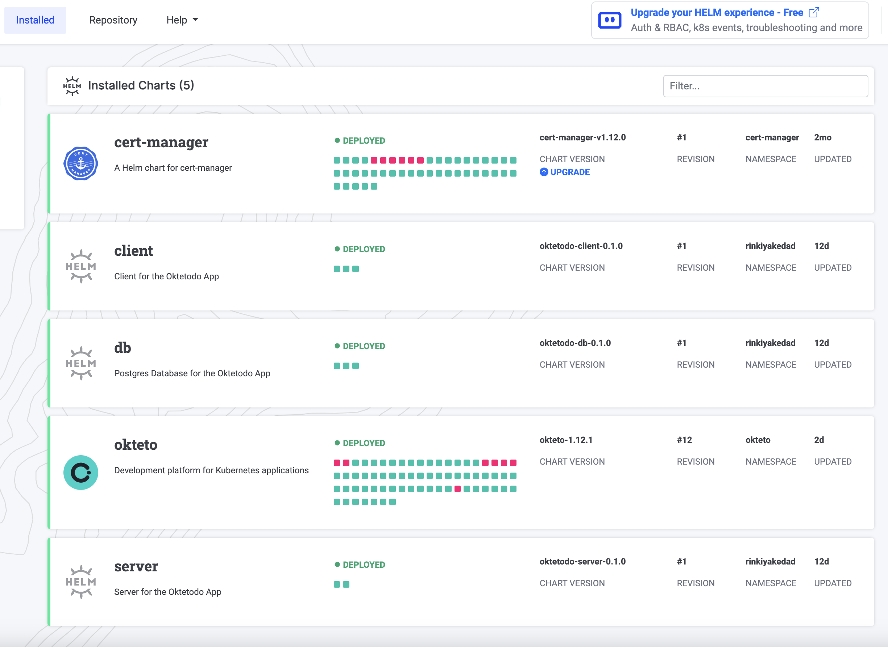
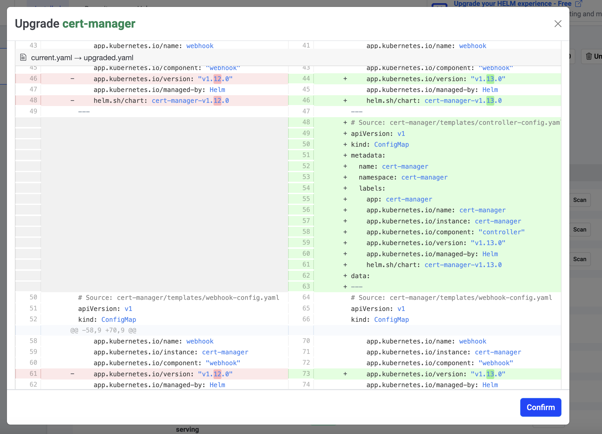
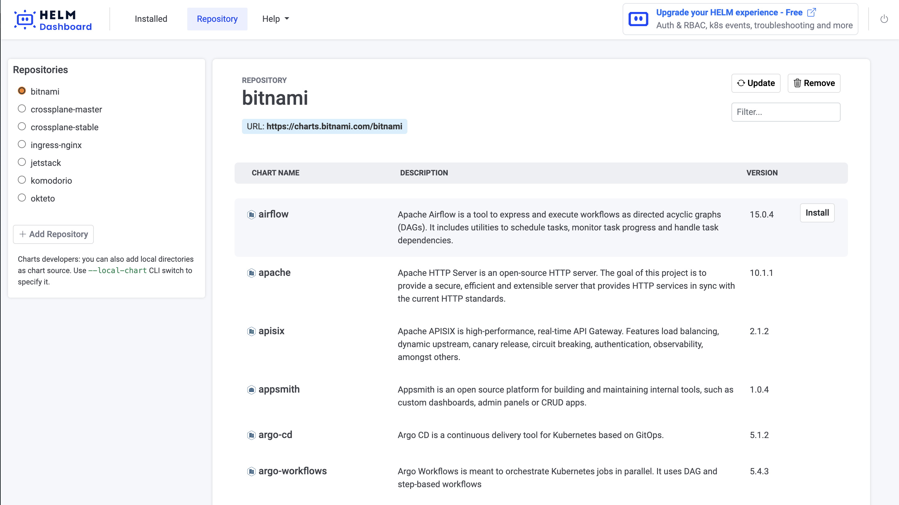

[Helm Dashboard](https://github.com/komodorio/helm-dashboard) is an open-source project by [Komodor](https://komodor.com/) that offers a visual and user-friendly way to manage and visualize all the [Helm](https://helm.sh/) charts installed in your clusters. Instead of using the terminal, you can leverage the Helm Dashboard's intuitive UI to perform a variety of tasks that make working with Helm a breeze. Here are some of its key features:

1.  Visually pleasing chart list: The dashboard presents all the installed charts in an aesthetically pleasing manner.
2.  Comprehensive K8s resource view: Get a clear overview of the Kubernetes resources associated with each chart installation.
3.  Manifest visibility: Easily access and examine the manifests included in the charts.
4.  Chart upgrade notifications and UI execution: Stay informed about available chart upgrades, and perform upgrades directly from the UI.
5.  One-click rollback: Effortlessly revert to a previous chart installation with just one click.
6.  Manifest diffing: Quickly identify and understand the differences between manifests when upgrading or rolling back to a different version.

In addition to these features, Helm Dashboard offers many other handy functionalities, which I will discuss further in the article. To summarize, almost anything you can do via the CLI, you can now accomplish with a few simple clicks in this elegant UI.

## The Value

I don't know about you all, but I absolutely adore sleek and user-friendly UIs that enhance accessibility, rather than relying on a multitude of CLI commands. These elements are crucial in making technology more accessible to a wider audience. Recently, while listening to a podcast, one of the speakers made an observation that resonated with me. As developers, it's easy to dismiss projects like these, thinking, "Who needs a UI when a terminal is faster?" However, what many fail to realize is that the tech industry has evolved significantly in the past decade.

We're witnessing an influx of individuals from diverse backgrounds entering the software industry, whether through bootcamps or self-learning. We need to stop always thinking of the terminal as the the most user-friendly tool for the job. By incorporating visual elements into our tools, we have the potential of empowering not only seasoned engineers but also newcomers with brilliant ideas and a desire to innovate. I think it's time more tools and platforms start embracing practices that cater to the needs of both veteran software engineers and aspiring newcomers, ultimately making everyone's lives easier.

And I'm not just referring to the simplicity of running upgrade or list commands with Helm. While it's easy enough to remember how to execute them through the CLI, expecting people to recall the command for comparing the manifest differences between the current chart and one from three revisions ago just to perform a rollback isn't ideal. Personally, I would much rather utilize a user interface than spend time deciphering the diff commands for this purpose.

The Helm dashboard project excels at delivering value through features like these! It showcases its strength in providing useful functionality and enhancing user experience when it comes to Helm. Let me talk about some of my favorite features now!

## Things I Really Liked About Helm Dashboard


### Super Easy to Get Started

The installation process is quite straightforward. You can simply download their [standalone binary](https://github.com/komodorio/helm-dashboard/releases) and run it to access your Dashboard. I appreciate that it reduces dependencies by not requiring `helm` or `kubectl` to be installed locally. However, since I already had both of them installed, I preferred adding it as a Helm addon for installation since it would allow for easier updates:

```bash
$ helm plugin install https://github.com/komodorio/helm-dashboard.git
```

After that just running `helm dashboard` had the UI instantly displayed, detecting all the clusters listed in my local kubeconfig. It offered a summary of the helm charts that were installed, giving me the flexibility to select the cluster who's charts I wished to view.



### Seeing Changes in Manifests and Values Between Different Versions

This is such a quality of life feature and makes things so much easier when you want to compare what has changed over the course of any upgrades you might have done to your installed charts. Not only does it let you diff between how the installation manifests have changed, but it also lets you see the differences between values provided during the chart installation. Another neat feature is that it also lets you see these differences when upgrading to a newer version. This way, you can see what additional resources you might be creating in your cluster with the newer update.



### No Security Risks

The cool part about this project is that everything runs locally and the dashboard gets values using helm commands only. Therefore, your cluster data remains secure because the project does not upload or fetch anything from any cloud service running on the internet. Everything remains limited to your local machine!

### Adding Repositories and Installing Charts

This is an area where having a user interface greatly enhances convenience compared to the terminal. In the UI, you can find a well-organized list of all the charts available in a repository. The list shows a description of each chart so you know what you're installing. Moreover, there is a convenient button to install the desired charts from the list. It's these small details that I truly appreciate about the project. They accumulate and significantly contribute to the overall usefulness of the project, especially for those who regularly work with Helm.



## Conclusion

In conclusion, the Helm Dashboard is a valuable tool that doesn't just meet the need for a user-friendly UI, but goes the extra mile in providing functionality that enhances the overall experience of working with Helm. If you haven't tried out the Helm Dashboard yet, I encourage you to [give it a whirl](https://github.com/komodorio/helm-dashboard) and see the benefits for yourself!

If you found this article helpful, consider following [me](https://arshsharma.com/) on [Twitter](https://twitter.com/RinkiyaKeDad) or [Dev.to](https://dev.to/rinkiyakedad) to stay updated whenever I share similar content :)