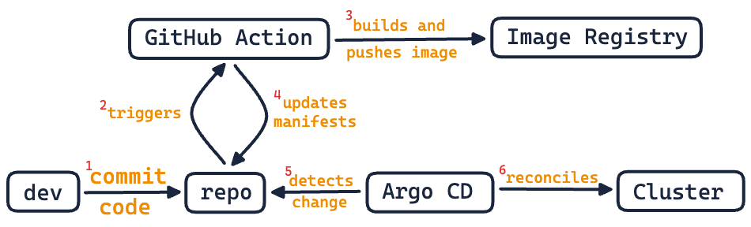
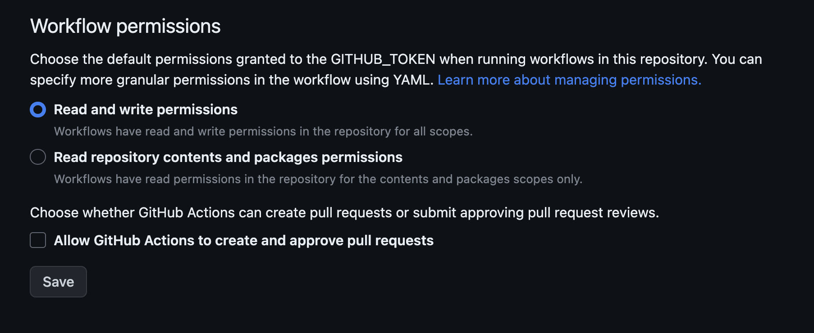
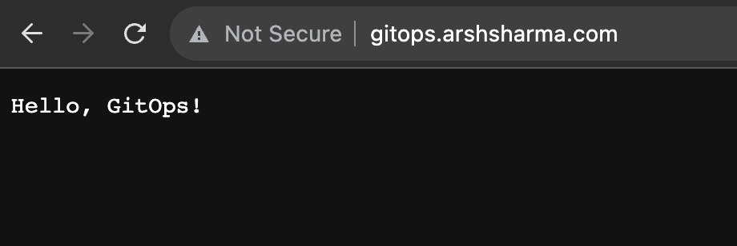
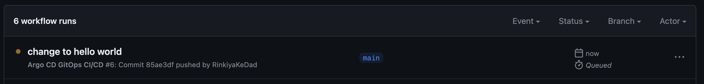
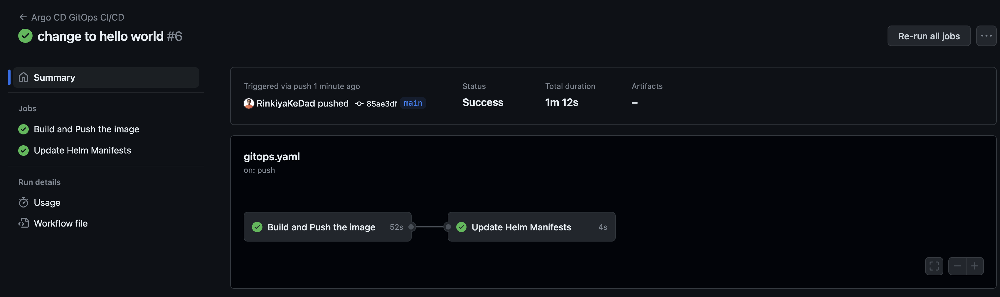
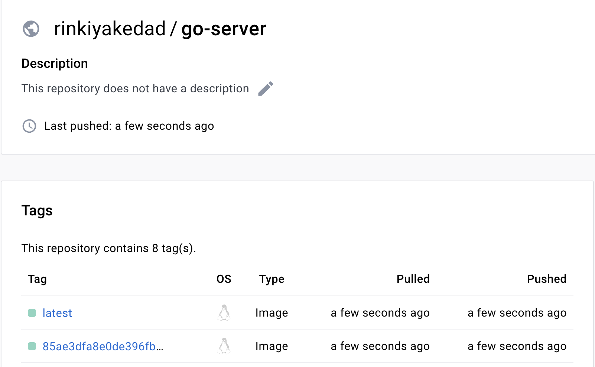
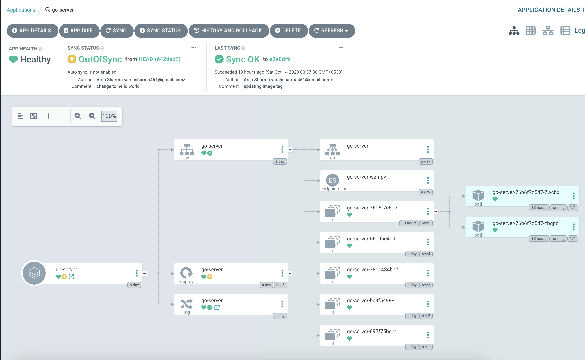
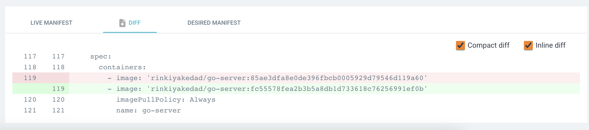
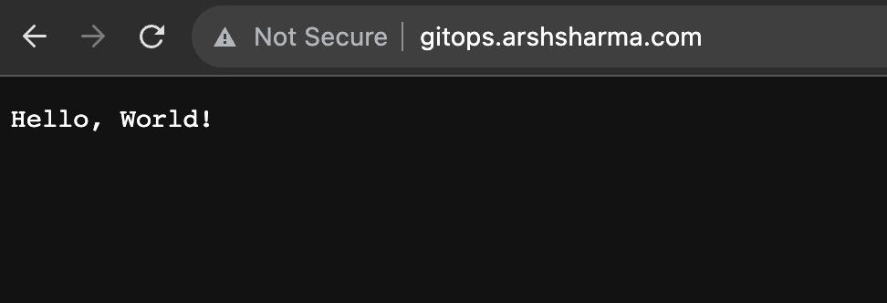
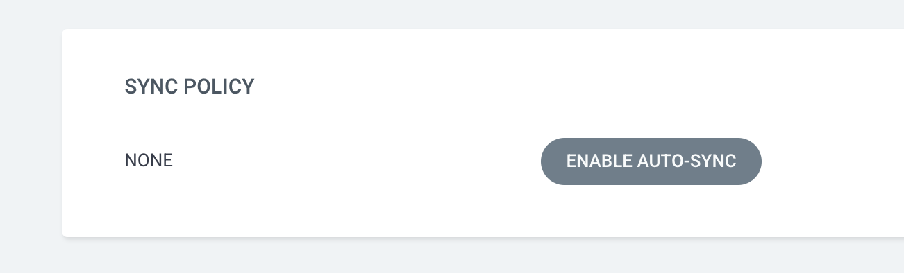

GitOps is gaining increasing popularity these days, and for good reason. The principles of GitOps promote the use of Git repositories as the ultimate source of truth for application infrastructure and configuration. This concept revolves around storing all application-related files and manifests in a Git repository, leveraging it as the central hub for deployment management. By combining GitOps principles with declarative continuous delivery tools like [Argo CD](https://argo-cd.readthedocs.io/en/stable/), you can significantly improve your deployment workflow and expedite the shipping processes, achieving faster and more efficient results.

However, when getting started, many people tend to unnecessarily complicate this process and give up, believing that it's too challenging to implement. In this article, I aim to debunk this myth and demonstrate how simple it is to get started with a GitOps workflow using Argo CD and GitHub Actions.

What Our End Result Would Look Like
-----------------------------------

Before we jump into the nitty-gritty of setting up a GitOps workflow, let's take a moment to visualize what our end result would look like. Our aim is to automate the entire delivery pipeline. After the setup is complete, developers can simply concentrate on writing code. Whenever a commit is merged into our main branch, our workflow will:

-   Kick off an image build
-   Push it to an image registry
-   Update our manifests with the latest tag
-   Have Argo CD make updates in the cluster.

The best thing about using Argo CD is that all we have to do is update our application manifests stored in a Git repository. Argo CD automatically detects those changes and applies them to the Kubernetes cluster. It "pulls" from the Git repository and treats it as the desired state, eliminating the need to manually "push" and apply updated manifests to the cluster each time. This approach is way better because:

-   Simplifies tracking changes over time with version control.
-   Enhances transparency and improves security by restricting cluster changes via pull requests only.
-   Facilitates easy rollback to previous versions, making it simple to undo changes by simply reverting commits.
-   Monitors the cluster to ensure deployed applications align accurately with Git repository manifests, maintaining the desired state effectively.

Here's a diagram to help you visualize the flow we'll be setting up using Argo CD:



Creating Our Continuous Delivery Pipeline
-----------------------------------------

I've already implemented this GitOps workflow in a sample app that we'll be using in the article. It'll help you understand how things work and give you inspiration for setting up your own projects. The sample app is a simple "Hello World" Go server that we deploy to Kubernetes using a Helm chart found in the `chart` directory: https://github.com/RinkiyaKeDad/gitops-sample

You can find step-by-step instructions (including installation) in the repo's [README](https://github.com/RinkiyaKeDad/gitops-sample/blob/main/README.md). Our main focus will be on understanding how the entire workflow comes together. Let's break it down into three parts.

### Building and Pushing the Container Image

When a commit is merged into our main branch, our GitHub action's `build` job comes into play. It handles the creation of a container image from the Dockerfile and pushes it to our designated image registry, which in this case is [Docker Hub](https://hub.docker.com/repository/docker/rinkiyakedad/go-server/general).

```yaml
# .github/workflows/gitops.yaml
...
jobs:
  build:
    name: Build and Push the image
    runs-on: ubuntu-latest
    
    steps:
    - name: Check out code
      uses: actions/checkout@v2

    - name: Login to Docker Hub
      uses: docker/login-action@v3
      with:
        username: ${{ secrets.DOCKERHUB_USERNAME }}
        password: ${{ secrets.DOCKERHUB_TOKEN }}
    
    - name: Build and push
      uses: docker/build-push-action@v5
      with:
        push: true
        tags: rinkiyakedad/go-server:${{ github.sha }} , rinkiyakedad/go-server:latest
```

To enable your GitHub Action to push the built image, you'll need to obtain a token from your container registry. For Docker Hub, you can find instructions on how to do this [here](https://docs.docker.com/docker-hub/access-tokens/). Once you have the token, it's best practice to add it, along with your username, to your repository secrets. You can refer to the official GitHub documentation [here](https://docs.github.com/en/actions/security-guides/using-secrets-in-github-actions#creating-secrets-for-a-repository) for detailed steps on how to do this.

One thing to note here is that we're tagging the image with the latest commit. This helps us update the image name used in the manifests to the most recent image with the last committed code. Argo CD will then detect the image change and reconcile any differences to align the cluster's actual state with the desired state described in the manifests.

### Updating Our Manifests

We've got the second piece of our puzzle sorted out with the `update` job in our GitHub action. Take a look at our helm chart - the image name isn't hardcoded. Instead, we make use of the values.yaml file for that.

```yaml
# chart/templates/deployment.yaml
...
    spec:
      containers:
        - name: go-server
          image: "{{ .Values.image.repository }}:{{ .Values.image.tag }}" 
          ports:
            - containerPort: 8080
```

After successfully building our image in the previous step, the next task is to update the image tag in the values.yaml file. This can be done by replacing the existing tag with the newly generated tag, which is essentially the SHA of the latest commit. This process is carried out in our `update` job.

```yaml
# .github/workflows/gitops.yaml
...
  update:
    name: Update Helm Manifests
    runs-on: ubuntu-latest
    needs: build

    steps:
    - name: Check out code
      uses: actions/checkout@v2

    - name: Update Image Tag Values
      run: |
        chart_dir="chart"
        new_image_tag=${{ github.sha }}

        # Update the values.yaml file with the new image tag
        sed -i "s/^  tag: .*/  tag: $new_image_tag/" "$chart_dir/values.yaml"
    
    - name: Commit the changes made
      run: | 
        git config --global user.name 'Arsh Sharma'
        git config --global user.email 'arshsharma461@gmail.com'
        git commit -am "updating image tag"
        git push
```

Once we've made the change, all that's left is to commit it to the main branch. This way, Argo CD can detect the update. To grant your GitHub action the permission to commit code, you just need to go to Repo settings, then Actions, and finally General -> Workflow permissions.



### Deploying The New Manifests

The final piece of the puzzle is installing Argo CD on the cluster we're using. Argo CD offers multiple configurations, so you have the flexibility to install it on the same cluster as production or a different one to manage things in your prod cluster. For simplicity's sake, I'll install it in the same cluster only. You can find the installation steps and how to log into the Argo CD UI in the repo [README](https://github.com/RinkiyaKeDad/gitops-sample/tree/main).

Once that's done, you'll need to go to the UI, click "New App" in the top right corner, then click "Edit as YAML" and copy-paste the following configuration. Save it, create the app, and you're good to go!

```yaml
# apps/go-server-prod.yaml
apiVersion: argoproj.io/v1alpha1
kind: Application
metadata:
  name: 'go-server'
spec:
  destination:
    name: 'in-cluster'
    namespace: 'prod'
  source:
    path: 'chart'
    repoURL: 'https://github.com/RinkiyaKeDad/gitops-sample'
    targetRevision: HEAD
    helm:
      valueFiles:
      - values.yaml
  project: 'default'
  syncPolicy:
    syncOptions:
      - CreateNamespace=true
```

The configuration should be pretty easy to understand. In the destination, we provide the name of the cluster as "in-cluster," which means deploying to the same cluster where Argo CD is installed. We also specify that we want this app to be deployed in the "prod" namespace and, in the `syncPolicy` section, tell Argo CD to create this namespace if it doesn't exist. Another thing to pay attention to is the `source` section. Here, we specify the repo and the folder where our app manifests are located. This is important because Argo CD will only look for changes in that specific `path` for this application. So, if you have other manifests in a different folder, it won't matter for ****this**** particular application. If you have a separate repo for application code and manifest (as you should!), you can take advantage of this to have the manifests for all your different applications in the same repo and specify different `path`s depending on the app.

Since we're using Helm, we also specify which values.yaml file to use. This is a cool feature because it allows you to use the same manifests with different values when deploying to staging, prod, or any other use case. And that's all the configuration you need! Once you create this app, Argo CD will be ready to monitor your repo and automatically make changes to the cluster.

Let's see it in action!

Seeing Our Workflow in Action
-----------------------------

So currently, when I visit my application, it says "Hello, GitOps!". I'll commit a change that swaps that text with "Hello, World!". 



Once I merge that commit to the main branch, you'll see our GitHub Action getting triggered.



Just hang on until both the jobs part of the action are done.



Once that is done, if you go to Docker Hub, you will see that your images have been pushed.



If you check out the Argo CD UI now, you'll notice that our application is "OutOfSync" with the latest code in HEAD.



Clicking on the "App Diff" button will show us exactly what differences are there, and we can see that there is a change in the tag of the image.



Clicking the Sync button will fix these differences and apply the latest manifests from the repo.


Once everything is back in sync, we can visit the URL and check out our updated application. Pretty cool, right?



Please note that if you prefer not to click the "Sync" button and instead allow Argo CD to automatically synchronize changes, you can navigate to the "App Details" button and enable the auto sync feature. I kept it disabled intentionally to demonstrate the process.



Best Practices
--------------

Just a heads up before we wrap up. The point of this article was to show you that starting with a GitOps workflow isn't as hard as it may seem. What we built here isn't something you should directly use in production, though. We didn't follow all the best practices to keep this guide simple. For example, I kept the application code and application manifests in the same repository. The recommended practice is to separate them into different repos, which has many benefits explained in the official docs. The only thing that changes in that case is modifying your GitHub action to commit code and make a pull request to a different repo. If you'd like a tutorial on that too, just let me know and I'll create something. Also, even if you're keeping things in the same repo, having the GitHub action commit directly to the main branch isn't ideal either. It's better to modify it to create a pull request that modifies the manifests and run tests on that PR before merging it. And once that PR gets merged, Argo CD will work its magic.

You should also consider throwing in some tests before pushing your code to production. The possibilities are endless! This is just a taste of what you can achieve by diving deeper into Argo CD and GitHub Actions. I'm confident that you'll create something more secure and robust than what I've shown here. But the key takeaway is that starting with GitOps on your own is not as hard as it might look. So go ahead and create some awesome stuff!

Conclusion
----------

That's it! We've got a fully automated GitOps workflow set up using GitHub Actions and Argo CD. Any changes we make to our codebase will automatically be built, pushed to the container registry, and deployed to our cluster without any manual intervention. This means we can deliver faster and with more control over deployments. And it wasn't really that scary, was it?

By the way, if you enjoyed this blog, consider following [me](https://arshsharma.com/) on [Twitter](https://twitter.com/RinkiyaKeDad) or [Dev.to](https://dev.to/rinkiyakedad) to stay updated whenever I share similar content. Thanks for reading and happy automating!