I consume a ton of media - books, shows, movies, games, you name it. And there are moments or lines in them that stick with me long after I'm done. So, I wanted a place to keep all these gems. Instagram was a big no-no for me because I have a love-hate relationship with that app. I wanted something different. Surprisingly, I couldn't find a convenient solution to save and list all these snippets for later viewing.

After days of searching, I thought a Hugo static website could be the perfect fit. Now don't get me wrong, I love markdown, but I'm also a bit lazy. If I have to manually write things down and commit changes, I know I won't be able to keep up with it. That's when I started looking for a CMS. And there was no way I was going to pay for one until I was sure I'd stick with maintaining the blog. Luckily, I stumbled upon Decap CMS, a free and open source CMS that integrates seamlessly with Hugo. I was pleasantly surprised by how simple and efficient my workflow became. Many folks out there want a CMS-powered personal blog, and that's why I wrote this article.

Let me show you how I created [quotes.arshsharma.com](https://quotes.arshsharma.com/) using Hugo, Decap CMS, and Netlify - all for free!

Creating Our Hugo Site
----------------------

[Hugo](https://gohugo.io/) is probably one of the most popular static site generators today. This blog you're reading (if you're reading it on [my website](https://arshsharma.com/)) is also made with Hugo. Once you have [installed Hugo](https://gohugo.io/installation/), run these commands to create a new blog called "blog-with-cms".

```bash
hugo new site blog-with-cms
cd blog-with-cms
```

Since Hugo makes it so simple to customize your blog with themes, let's also quickly add this theme I used for my blog called [paper](https://themes.gohugo.io/themes/hugo-paper/).

```bash
git init
git submodule add https://github.com/nanxiaobei/hugo-paper themes/paper
```

What this basically does is initialize a git repository for your blog and then add the paper theme as a submodule. [Git submodules](https://git-scm.com/book/en/v2/Git-Tools-Submodules) are simply a way of referring another repo in your own repo. This allows you to easily update your theme to the latest commit just like you would for a normal repository by fetching from the source repo instead of manually having to copy-paste files. Once you have it cloned, go to your `hugo.toml` file and add the following line:

```toml
theme = "paper"
```

Once you have done this, you should be able to access your blog at `http://localhost:1313/` by running the following command:

```bash
hugo server
```

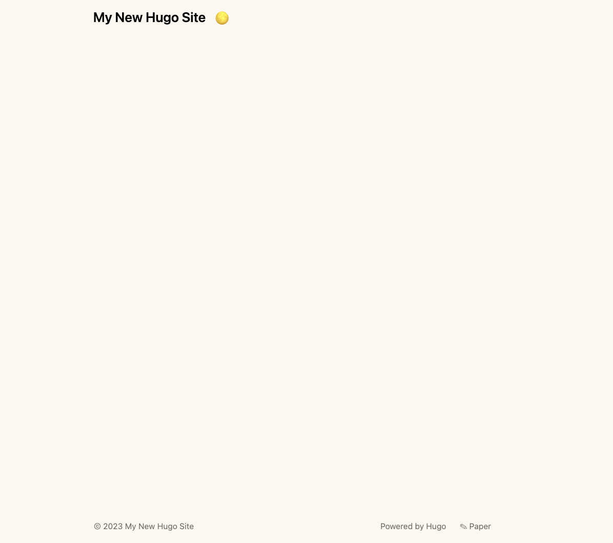

Looks a bit empty, isn't it? Let's add our first blog post by creating this file (and the needed folders).

`content/posts/first-post/index.md`:

```markdown
---
title: First post
date: 2023-11-10
---
This is my first post!
```

Your website should automatically reload and you should be able to see your post. 

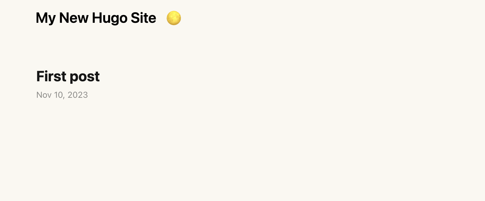


Much better! Wasn't this easy now? Let's now deploy our blog so that it's accessible to everyone on the internet.

Deploying Our Website with Netlify
----------------------------------

Decap CMS was open sourced by Netlify, so no surprise that it is the easiest to configure with Netlify only. That's not a problem since I like Netlify for hosting anyway. So let's do that. Make sure to create a GitHub repo and commit and push your latest changes. Once that is done, log in to Netlify and go to Sites -> Add new site -> Import an existing project.

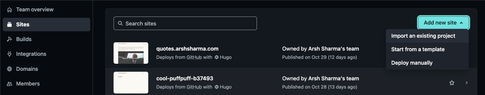

Choose the "Deploy from GitHub" option and follow the steps to add your repository. I'm not adding screenshots for the exact screens you'll see, but it should be pretty intuitive.

Once you add your repo, make sure your settings are like this:

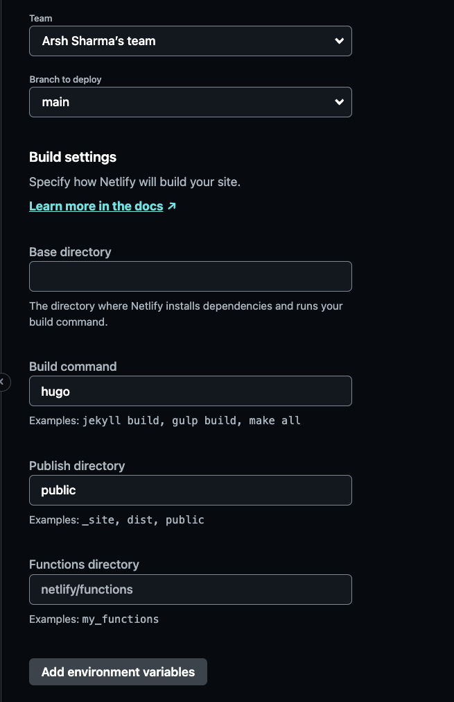

The command to build your website with Hugo is `hugo` (who'd have thought, right?) and then Hugo will put all the generated files for your website in a folder called `public`, so that's what we choose in the "Publish Directory". Netlify should automatically pick these settings up for you because it recognizes that we have a Hugo website in there. Once you do that, click the deploy button...


...and if you're reading this in November 2023, at least then be prepared for the deploy to fail. Our build will fail because Netlify expects the config file to be called `config.toml` or `config.yaml`, whereas the Hugo command to create a new site gives us a `hugo.toml`. This took me a good couple of days to figure out: https://answers.netlify.com/t/unable-to-build-hugo-blog-for-deployment/105283. But anyways, change the filename to `config.toml`, commit your changes, and redeploy, and you should be good to go.

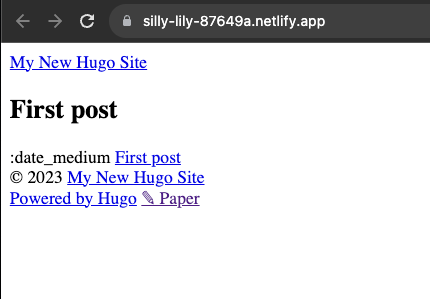

Not really, right? Hahaha. Now, I don't know why this is the case, but for Netlify to load your Hugo theme, you need to take the deploy URL Netlify gave you (or your custom domain if you're using that) and put that as the value for `baseURL` in your `config.toml`.

```toml
#config.toml

baseURL = 'https://silly-lily-87649a.netlify.app/'
languageCode = 'en-us'
title = 'My New Hugo Site'
theme = "paper"
```

Push your changes and run the build again, and everything should be working as expected now, finally :)

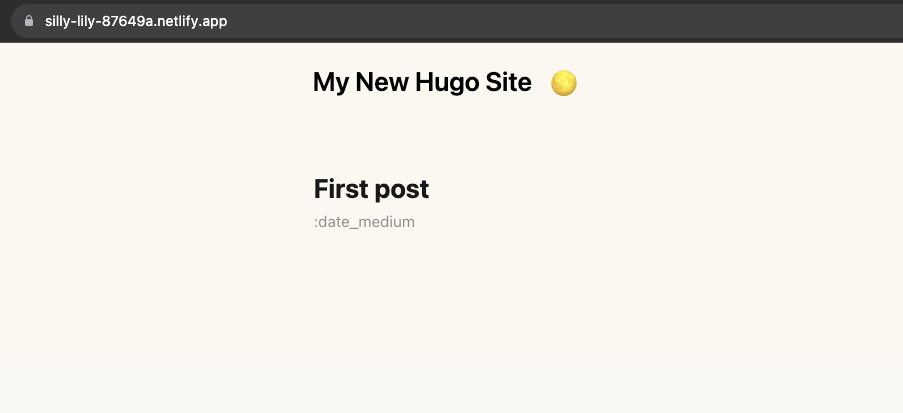

> They might fix this later, so you might not need to change the `baseURL` in the future, but it is still a good practice to update that.

We'll get to fixing the date not being shown properly later.

Adding Decap CMS to the Blog
----------------------

Now to the fun stuff which will make our lives easier when adding posts to our blog. The most up-to-date documentation on how to add Decap CMS to your blog can be found [here](https://decapcms.org/docs/add-to-your-site/). I'm mentioning this in case things change when you're reading this in the future. But mostly things in this blog should be valid only.

The first step is creating an `admin` folder inside the `static` folder in the source code for your website with the following two files:

`index.html`:

```html
<!doctype html>

<html>

<head>
    <meta charset="utf-8" />
    <meta name="viewport" content="width=device-width, initial-scale=1.0" />
    <meta name="robots" content="noindex" />
    <title>Content Manager</title>
    <script src="https://identity.netlify.com/v1/netlify-identity-widget.js"></script>
</head>

<body>
    <!-- Include the script that builds the page and powers Decap CMS -->
    <script src="https://unpkg.com/decap-cms@^3.0.0/dist/decap-cms.js"></script>
</body>

</html>
```

The second file is what maps the fields someone using your CMS will see to the front matter properties of your Hugo blog (the things like `title` and `date` which we manually added for our first blog post):

```yaml
#static/admin/config.yml

backend:
  name: git-gateway
  branch: main
media_folder: "static/images" # Folder where user uploaded files should go
public_folder: "images"
collections:
  - name: "posts" # Used in routes, e.g., /admin/collections/post
    label: "Posts" # Used in the UI
    folder: "content/posts" # The path to the folder where the documents are stored
    path: "{{slug}}/index"
    media_folder: "" # Save images in the post's own folder instead of the static folder
    public_folder: ""
    create: true # Allow users to create new documents in this collection
    fields: # The fields for each document, usually in front matter
      - { label: "Title", name: "title", widget: "string" }
      - { label: "Publish Date", name: "date", widget: "datetime" }
      - { label: "Featured Image", name: "image", widget: "image" }
      - { label: "Tags", name: "tags", widget: "list", summary: "{{fields.tag}}", field: { label: "Tag", name: "tag", widget: "string" }} # https://github.com/decaporg/decap-cms/issues/4646 
      - { label: "Body", name: "body", widget: "markdown", hint: "Make sure to name added image as thumbnail" }
```

Most of these fields should be pretty self-explanatory thanks to comments added by [Eric Murphy](https://youtu.be/ZyIiY2m7OpY) for the video tutorial he did on this. You can read about more of these fields in the [official docs](https://decapcms.org/docs/add-to-your-site/#configuration).

Once you're done with this, you need to go to the Netlify settings for your site and enable identity.

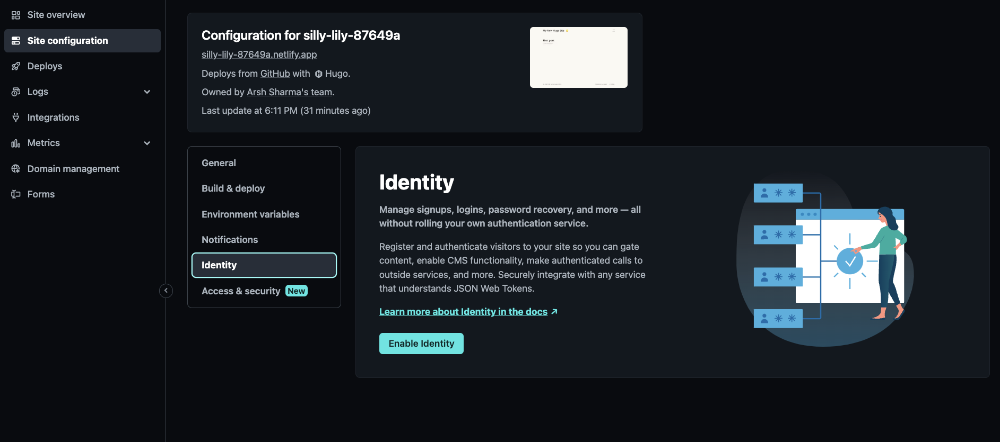

Then, under registration preferences, select "Invite only" and hit save.

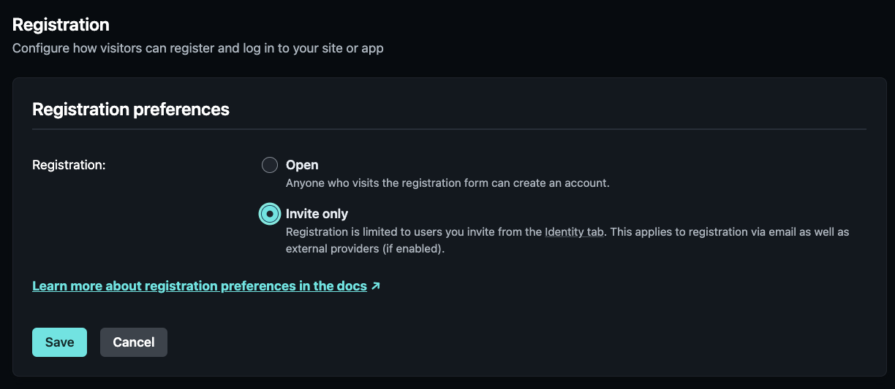


I find Google to be the easiest authentication provider to allow people to access your CMS. Choose that and just use the default configuration.

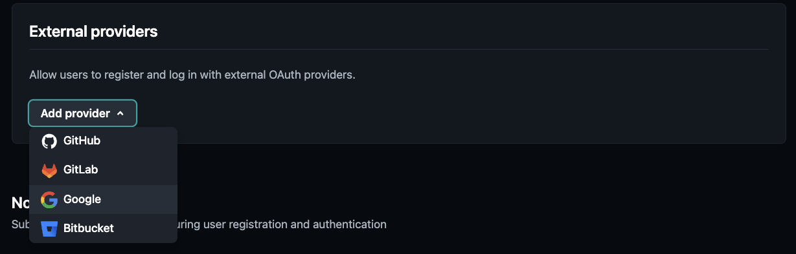

Then go to the Service section and enable Git Gateway. This will allow Decap CMS to make the necessary changes in your repo when someone adds a post via the CMS.

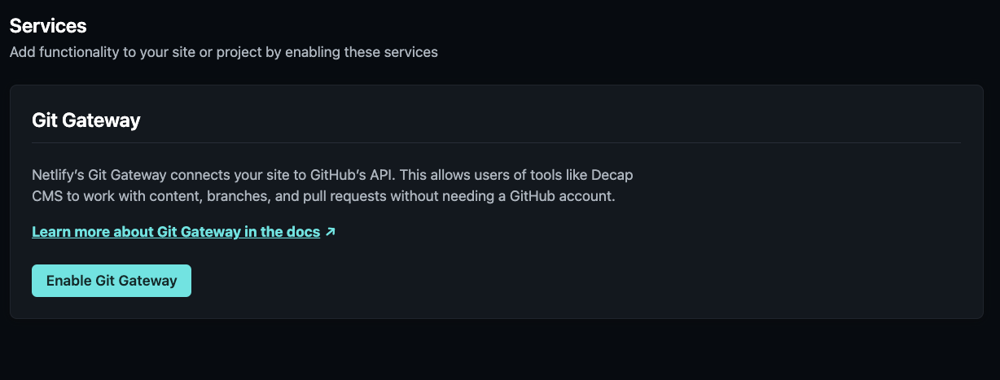


Now let's add the email addresses of the users whom we want to allow to log in via Google Auth into our CMS and post content. Click the identity tab link in the registration preferences setting (weirdly, I couldn't find how to get to it from any other place in the UI).

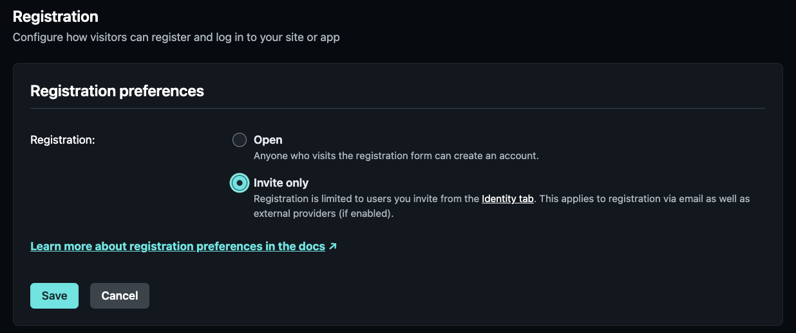

Once you get there, click the invite users button and add their email addresses. 

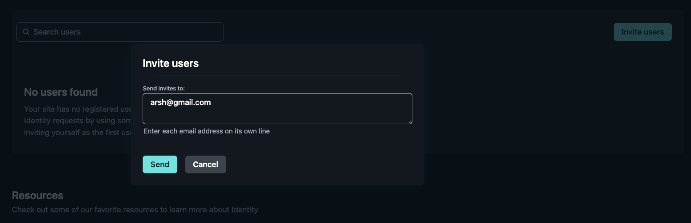

The accounts you add should receive an email to accept the invite.

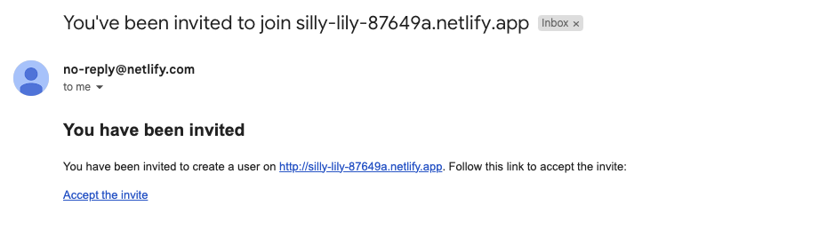


Once all this is done, we need to add the widget that people will see, which will allow them to log in to the CMS. For that, we need to add the following code in two places:

```html
<script src="https://identity.netlify.com/v1/netlify-identity-widget.js"></script>
```

One of them is the `index.html` file we already created, and if you copied and pasted from this blog, it should already be there. The other is in the `<head>` section of your main site. Now finding this is simple, just search for `<head>` in your code:

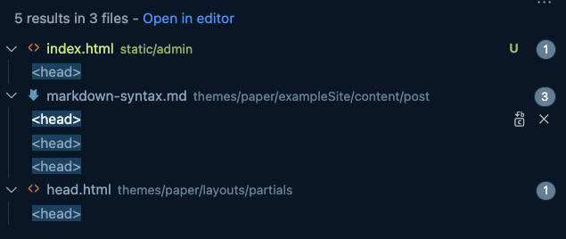

And you'll know that it is the one that's under `themes`. But the thing is that the code is added as a submodule, and we don't want to change that. Because let's say in the future you update your theme, then you would have to make the change again because the source repo for that submodule won't have this code for the widget snippet added. The good thing is that Hugo already accounts for cases like this :) If you see the source code for your website, there's a `layouts` folder in the root as well (separate from the one inside the `theme` folder). Create `partials/head.html` there as well just like in the themes folder and copy the content of the `head.html` in the themes folder to this one.

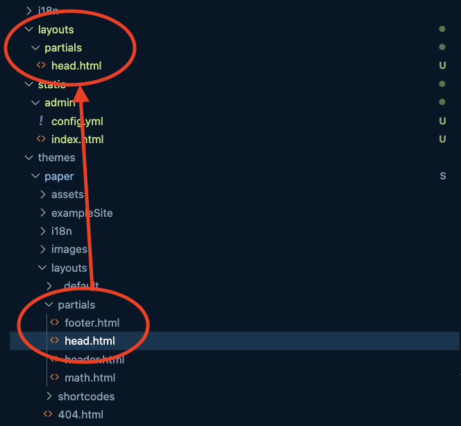

Now what this does is it will make Hugo use the new `partials/head.html` we created instead of the one present in our theme submodule. This way we can update our theme without having to ever worry about adding the widget code snippet again since our head.html will replace the one of the theme always. Now anywhere between the opening and closing `head` tags in this file add the widget snippet code (but obviously not between any two other tags).

Almost there. The final step is repeating this process for the body tag. Create the `layouts/_default/baseof.html` and copy the contents from `themes/layouts/_default/baseof.html` to it.

> All of this is valid in case you're using the Paper theme. If you're using some other theme, your `head` and `body` tags could be in some other file, and you would have to create the corresponding files in your `layouts` directory and add the snippet code.

Now just before the body tag closes in the `baseof.html` file, add the following code:

```html
<script>
  if (window.netlifyIdentity) {
    window.netlifyIdentity.on("init", user => {
      if (!user) {
        window.netlifyIdentity.on("login", () => {
          document.location.href = "/admin/";
        });
      }
    });
  }
</script>
```

And this concludes all the setup we needed to do for Decap CMS. Commit and push your code and wait for Netlify to deploy the changes.

Seeing Our CMS in Action
------------------------

Whatever URL Netlify is showing for your deployed website, go append '/admin' to that (for example: https://silly-lily-87649a.netlify.app/admin) and log in using Google with the account whose email you added during configuration.

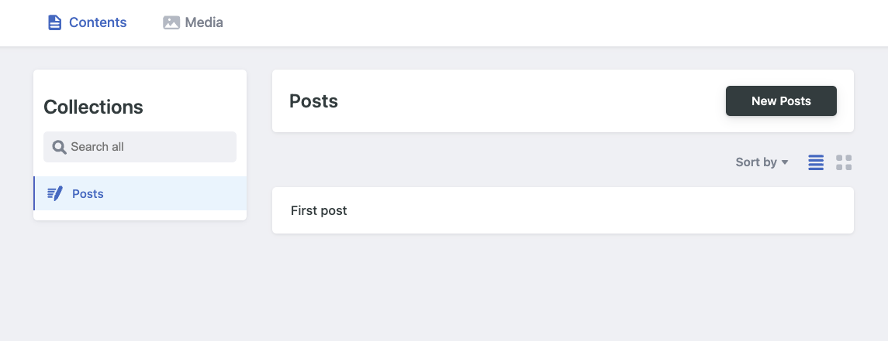

Once you're logged in, you'll see our "First Post" there and also a button to create new posts. Click that and fill out the details for your second post.

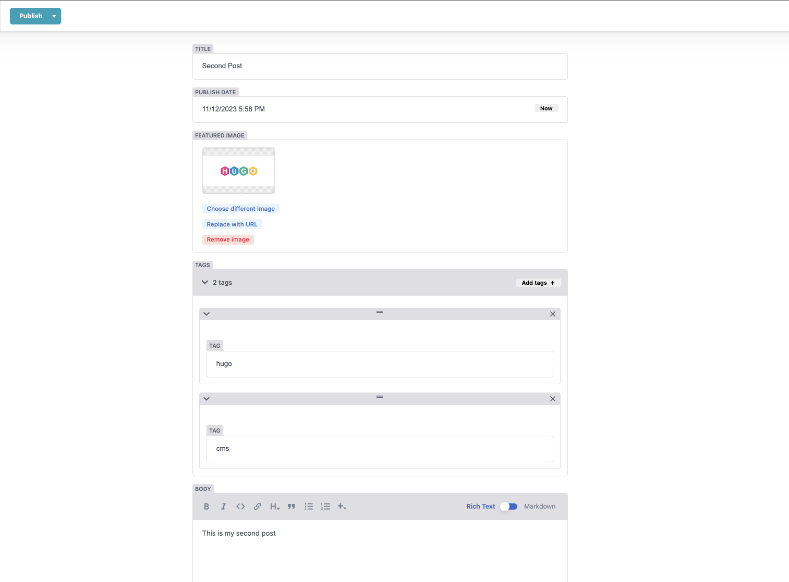


Once you're done, hit "Publish now" in the top left corner. When you do that, Decap CMS will create a commit in your repository adding the markdown file (and cover image) for this blog. Then a Netlify build will be triggered which would show us the updated website.

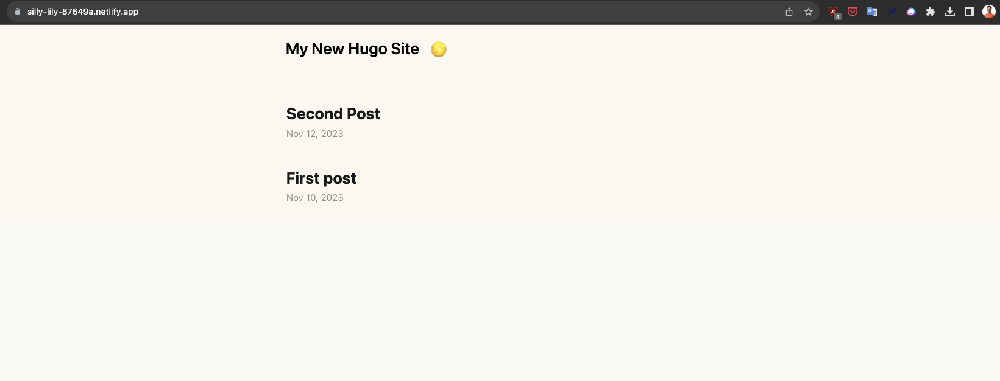

And ta-da! We can now see our updated site. All without manually having to write or commit anything. Decap CMS for the win! Also, I figured out why the dates weren't loading correctly. It was because of Netlify not using the right version of Hugo during build. For that, I added the following `netlify.toml` at the root of my repo which specifies what Hugo version to use for building.

```toml
[build]
  command = "hugo"
  publish = "public"
  [build.environment]
    HUGO_VERSION = "0.119.0"
```

Conclusion
----------

I hope this blog has provided you with a great starting point to create your own blog using free and open-source tools like Hugo and Decap CMS. You can find the code for this sample blog in this repository: https://github.com/RinkiyaKeDad/blog-with-cms

If you found this article helpful, please share it with your friends and follow me on [Twitter](https://twitter.com/RinkiyaKeDad) or [Dev.To](https://dev.to/rinkiyakedad) to stay updated with more valuable content :)