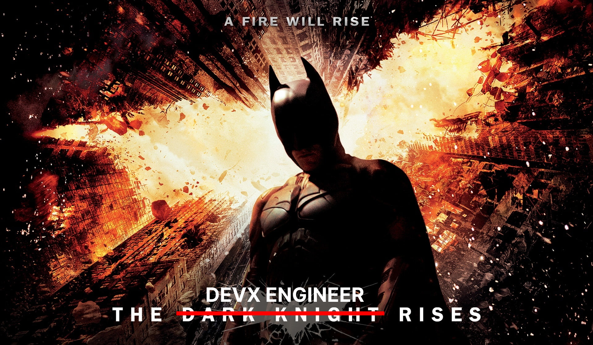

I've been working at [Okteto](https://www.okteto.com/) for over two years now. My job title officially is Developer Experience (DevX) Engineer. I've been asked more times than I can count what it means and what my role involves. I think after two years, I finally have enough understanding to write about it in detail :)

## How It Began

I'll be completely honest - when I had joined the company, I didn't fully know what I was signing up for. I had initially joined thinking I would be doing technical writing - blogs, documentation, and a bit of traditional DevRel stuff - conference talks, webinars, etc. I was excited for both these things so I said yes!

However, I had previously always been a part of engineering teams, so I was a bit hesitant about not doing something engineering related. I discussed this with my manager, expressing my desire to also engage in engineering work. It made sense to her as well because you can't really create technical content without having knowledge about the product. My manager shared [an article](https://www.netlify.com/blog/2021/01/06/developer-experience-at-netlify/) from the Netlify team with me, which discussed the DevX engineer role.

In short, the DevX engineer role at Netlify was a combination of marketing and engineering. DevX engineers would spend half of their time on the marketing team, creating technical content and assisting with other initiatives. The other half of their time would be dedicated to engineering, working on features. This allowed them to gain product knowledge, which they could then leverage to support marketing efforts. Inspired by this, I joined with the intention of collaborating with the marketing team to create technical content and contributing to our [open source CLI](https://github.com/okteto/okteto) as a way to help me learn about the product. However, here comes the plot twist.

## What Worked and What Didn’t Work

I had absolutely no problem getting onboarded on the marketing side. Within a few days, we were ready with a content strategy and I was working on articles. I soon picked up some documentation efforts as well. So far, my knowledge of the product was limited but enough to get me started with creating content and sympathize with the problem we were solving.

However, we had trouble getting value out of my involvement with engineering. I wasn't fully able to get engaged in the engineering team's processes because I was just not able to give time to both teams simultaneously. But at the same time, I did need to learn more about the product in order to create better content and support marketing efforts. A turning point for us was discovering that doing engineering work might not be the best way to learn about the product. And that's where things took a turn for the better!

## The Missing Perspective

I realized that I needed to learn more about the product from a user perspective. I wanted to know and experience everything - from installation to using all features, to integrating it with other tools. I always strive to get the maximum value out of the time I spend learning anything. And I had the same plan this time as well. So, I created an action plan to learn about the product and started working on it. As I did, I documented any friction points I encountered and things I felt we could improve. In the end, this turned out to be very valuable feedback for the product team. And here's where we found the perfect opportunity for my role!

Being a dev tools company with a highly technical product comes with its own set of problems. The engineering team has in-depth knowledge about the product and its internal workings, which can create a bias and not allow them to view things clearly from a user perspective. On the other hand, departments with members from non-software engineering backgrounds may not have enough technical understanding to give detailed product feedback. However, it is crucial to have someone who can advocate for the users internally **and** create technical content to educate users and promote the product externally.

Actively spending time learning about the product and exploring various areas enabled me to create more relevant content to assist our users and customers. It also satisfied my desire to stay connected with the engineering side of things while still allowing time for other marketing initiatives. Additionally, the feedback I gathered during the learning process proved to be incredibly valuable for the product. A definite win-win situation in every aspect!

## The Developer Experience Engineer Rises!
Let me now sum up the role of a Developer Experience Engineer and why I believe it is crucial in dev tools companies.

A DevX engineer, while usually under the marketing department, plays a very cross-functional role with the product and sales teams. The primary objective is to educate users about your company's technical products. This requires clear communication skills across different mediums such as [blogs](https://www.okteto.com/blog/authors/arsh-sharma/), webinars, [recorded videos](https://www.okteto.com/videos/with/arsh-sharma/), and [conference talks](https://arshsharma.com/speaking/), emphasizing the value and demoing the usage of different product features. Additionally, it involves thought leadership to educate people about emerging spaces, like Platform Engineering in my case.

A DevX engineer should have sufficient proficiency with the product to be able to give demos at conferences, create sample apps, and work on integrations with other tools. However, the usage of the product must be very **intentional**, consistently identifying friction points and areas for improvement. As the voice of developers within the company, a DevX engineer collaborates closely with the product team, providing valuable feedback. This role also involves collaborating with the sales team to equip them with content that effectively explains the nuances of the product to prospects.

I might sound biased, but these are the reasons why I consider the role of a DevX engineer so important for a dev tools company. A technical product requires someone who can effectively communicate its intricacies to users **and** also analyze the product from a user's perspective, providing feedback internally. In my opinion, no other team member is better positioned for these tasks than this role.

## Conclusion

Since I've been working as a Developer Experience Engineer, almost every week has looked different. Even after more than two years, I'm still working on and learning new things, which is the most exciting part of the role for me. One day, I'm building a sample app, and the next day, I'm learning how to edit videos. No week is the same.

I hope this article helped you understand what this role entails. I have seen some companies define it differently, where DevX engineers work on providing an internal development platform, but I think that falls more under platform engineering now. Our industry has too much jargon, and I hope I helped clear up one piece of it today :)

As always, thanks for reading along. I hope you found this useful, and if you'd like to be notified whenever I post, connect with me on [X](https://twitter.com/RinkiyaKeDad) or [LinkedIn](https://www.linkedin.com/in/arsh4/), maybe? Until next time!