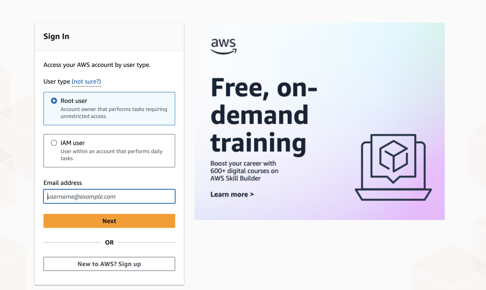
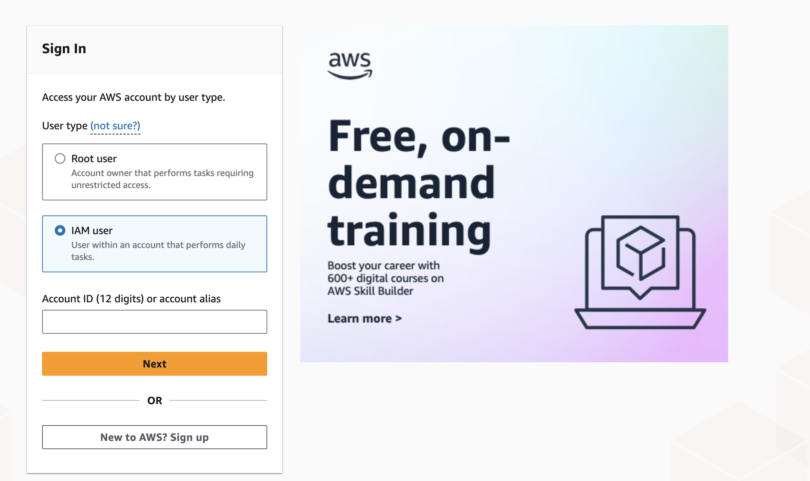

Welcome to the first in a series of blog posts about AWS! Throughout this series, I'll be covering various AWS topics as [I prepare](https://x.com/RinkiyaKeDad) for the [AWS Solutions Architect](https://aws.amazon.com/certification/certified-solutions-architect-associate/) exam. I thought what better place to start than with one of the most fundamental steps when beginning with AWS: creating an account. In this post, I'll discuss the root user that's created with your AWS account and how it differs from IAM users.

## What is a Root User in AWS?

When you first create an AWS account, you'll enter an email, and AWS will create a root user with this email by default. Initially, this root user is used to sign in and access your AWS account. Root user is the first user identity in an AWS account.

Every AWS account has only one [root user](https://docs.aws.amazon.com/IAM/latest/UserGuide/id_root-user.html) associated with it, which has the permissions to do anything and everything in the account. The permissions of the root user **_cannot_** be restricted. Because of these reasons, it is not recommended that you use this root user unless absolutely necessary (for things like changing billing information, your AWS support plan, etc., that is, things only root users can do).

Other than these root user specific tasks, whenever you want to interact with your AWS account, it is recommended you do so via an IAM user. It is very common to create an IAM user with admin privileges right after creating your AWS account and use that IAM user instead of the root user for any subsequent interactions with the AWS account.

## What is an IAM User in AWS?

IAM stands for Identity and Access Management, and it's a way in AWS to create users (among other things as well, but more on that later). [IAM users](https://docs.aws.amazon.com/IAM/latest/UserGuide/id_users.html), unlike the root user who uses email to sign in, use an account ID and their IAM username and password to log into the AWS console.

You can create as many IAM users for your AWS account as you want. You can (and should) give them different levels of permissions. But it is a common practice to have one or two IAM users with [admin privileges](https://kloudle.com/academy/how-to-create-an-iam-admin-user-in-aws/) which are to be used by people managing the overall AWS infra in your organization.

These IAM users with admin privileges can do almost everything you would want to do within AWS. AWS recommends that you use them instead of ever using the root user. This is because it's in line with the [principle of least privilege](https://www.paloaltonetworks.com/cyberpedia/what-is-the-principle-of-least-privilege). A root user still has more permissions to do things which an IAM admin user won't, things like deleting your AWS account, subscribing to a different support tier (which would cost you more money), and because of these reasons if the root user credentials are compromised you'll be in much greater trouble. You can find a complete list of the extra things a root user can do as compared to an IAM user with admin privileges [here](https://docs.aws.amazon.com/IAM/latest/UserGuide/id_root-user.html#root-user-tasks).

So long story short, as soon as you create your AWS account, use the root user credentials to create an IAM user with admin privileges and henceforth use this IAM user for any further resources/users you want to create in your AWS account.

## Conclusion

So to sum up here are the differences between the root user vs. an IAM user in AWS:

- The root user has unrestricted access and can do [much more](https://docs.aws.amazon.com/IAM/latest/UserGuide/id_root-user.html#root-user-tasks) than an IAM user (even with admin privileges). This includes important things like changing your support plan, billing information, closing your account, enabling or disabling security controls like MFA.
- There's only one root user per AWS account whereas you can have multiple IAM users.
- The root user's permissions can't be restricted at all, and it can do anything related to your account. IAM user permissions can be limited with the help of [policies](https://docs.aws.amazon.com/IAM/latest/UserGuide/access_policies.html) (will cover in detail in a future blog)
- You should avoid using the root user unless absolutely necessary for a task. Instead, use an IAM user with admin privileges.
- IAM users don't have access to the Billing and Management Console by default, even if you attach the right policies. The root user needs to specifically enable access to the Billing and Management Console for IAM users, only after which they can access it (assuming they have the correct policies attached to them).
- Root user signs in using the email used when creating the AWS account, whereas the IAM users have a username which they login with.

If you liked this guide and would like to stay updated on when I post next in this AWS series, consider signing up for my newsletter:



<iframe
scrolling="no"
style="width:100%!important;height:220px;border:1px #ccc solid !important"
src="https://buttondown.email/arsh?as_embed=true"
></iframe>  

