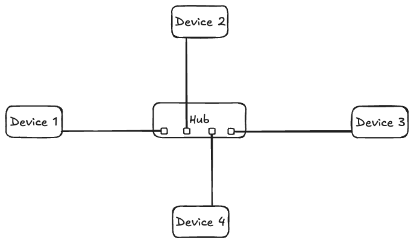
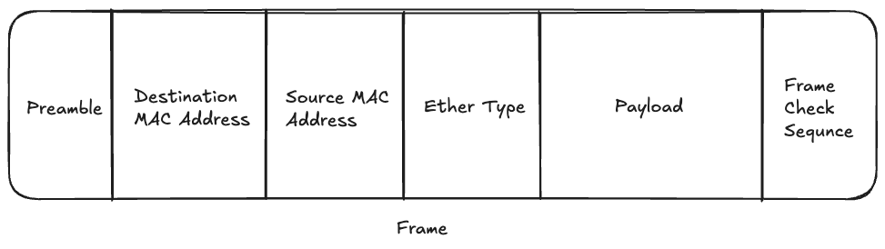

The OSI (Open Systems Interconnection) Model is a framework that helps understand how communication between computers takes place in a network. It consists of 7 layers, and each layer builds on top of the ones below it and adds additional functionality. In this blog, we’ll understand the different layers part of this model, starting from Layer 1 at the bottom. All layers rely on the layers below them to continue functioning.

## Layer 1 - Physical Layer

Layer 1 of the OSI model deals with how devices communicate across a shared physical medium. For example, if devices are connected by an Ethernet cable, then the shared medium is the cable; if devices are connected by Wi-Fi, then the shared physical medium is radio frequencies.

When communication takes place over the physical medium in Layer 1, it is in the form of raw bit streams (that is, 0s and 1s). For example, if devices are connected by a cable, then a certain voltage (say +1V) can be defined as binary 1, and another voltage (say -1V) could be defined as binary 0. All devices part of this Layer 1 network need to have this shared understanding, that is, have the same standards in order to communicate.

A hub is a device that can be used to connect multiple Layer 1 devices together and allow communication between them. Hubs take electrical signals on one port and distribute them across all other ports without any checks. 

Important things to note about the Physical Layer are:

1. There are no individual device addresses. A device cannot specifically address traffic to another device part of a Layer 1 network. It is broadcasted to all the devices part of the network connected by a hub.

1. If multiple devices transmit at once, a collision will occur. Layer 1 has no way of detecting collisions. And since anything received on any port of a layer 1 hub is transmitted to every other port, the collisions get repeated across all devices as well.

1. There is no method to control which devices can transmit over Layer 1 (also called having “no media access control”).

So I think you can start to see that while the Physical Layer of the OSI model forms the foundation of network communication, it on its own isn’t very useful. As you connect more Layer 1 devices together with the help of a hub, the chances of collisions increase even more. Let’s see how Layer 2 fixes this.

## Layer 2 - Data link Layer

The Data link Layer of the OSI model builds on top of the Physical Layer. This means a Layer 2 network requires a functional Layer 1 network to operate.

Layer 2 devices have a Media Access Control (MAC) address. MAC addresses for devices are unique and generally not software-assigned. Instead, they’re attached to that particular piece of hardware.

Layer 2 also introduces the concept of “frames,” which are a way of sending information over the network. Let’s see the parts of a frame:

- Preamble: This is the start of a frame. Knowing the start allows devices to figure out where the other parts of the frame are.

- Destination MAC address: MAC address of the device the frame is intended to be received by. If the MAC address is FF-FF-FF-FF-FF-FF (all Fs), that means it’s meant to be received by all the devices on the network, also known as a broadcast.

- Source MAC address: This is important because it allows the receiving devices to send back replies to the device that was the source of the frame.

- Ether type: This is used to specify which Layer 3 protocol is putting the data inside the frame. A common example of this is IP (Internet Protocol).

- Payload: This is the data the device wants to send. Layer 3 generates some data, which is put inside the payload in the frame (a process called encapsulation). The frame then delivers the data to different Layer 2 devices. On the destination Layer 2 device, the frame is analyzed, and the Layer 3 data is extracted and given back to the Layer 3 at the destination device. Please note that the frame is still being transferred by Layer 1. Layer 1 sees the frame as just another piece of data to send over the physical medium.

- Frame check sequence: This is used to identify errors in the frame and lets the destination check if any corruption has occurred.

## Layer 2 vs Layer 1 of the OSI Model

We just learned that Layer 2 uses Layer 1 to transport frames. How does that solve the problems of collisions we discussed earlier in Layer 1? This is because Layer 2 provides controlled access to the physical medium. Layer 2 devices have the ability to check if any carrier (signal) is already present or not and then accordingly instruct Layer 1 to do any transmission. This is how collisions are avoided. This method is called Carrier Sense Multiple Access (CSMA). Also note that Layer 1 does indeed send all frames to all connected devices. It’s just that Layer 2 devices analyze those frames and discard them if they’re not the intended recipient after checking the MAC address.

Just like a hub is used to connect multiple devices in a Layer 1 network, for Layer 2, we use a device called “Switch”. This is because hubs don’t understand frames. If a Layer 2 device sends a frame to a hub, it would repeat it to all connected devices. This is inefficient and can be solved by a device that understands MAC addresses: the switch.

Switches maintain a MAC Address Table, which starts off empty. But over time, as they receive frames, they populate the table. The table stores which device (by storing its MAC address) is connected to which port. Once this is populated, they don’t blindly forward frames like hubs. So if a frame is transmitted, the switch will send it only to the port whose MAC address is the intended destination. If in case the destination MAC address isn’t in the table, the frame will be transported to all ports. With switches, even if a collision occurs, it remains isolated on the port it occurred on instead of being transmitted to all ports, as in the case of hubs.

Switches also have an aging time for MAC addresses. When switches first store a MAC address they store it with a timestamp. Anytime the switch detects some traffic from this stored MAC address it updates the timestamp. If after a fixed amount of time there has been no traffic detected from the last saved timestamp in the switch for that MAC address the switch removes entries for it. This is known as the aging process for MAC addresses in a switch.

## Conclusion

In this blog, we learned about Layer 1 and Layer 2 of the OSI model. Layer 2 devices are still connected to each other over a Local Area Network (LAN). But how do you send data from a Layer 2 device part of a LAN in India to one in the US? This is where Layer 3 starts to come into the picture. To avoid making the blog lengthy (and give you some time to digest all this information), I’ll be covering that in the next blog. I hope you found this one useful, and if you’d like to stay updated on whenever I post a new blog, consider signing up for my newsletter!


<iframe
scrolling="no"
style="width:100%!important;height:220px;border:1px #ccc solid !important"
src="https://buttondown.email/arsh?as_embed=true"
></iframe>  


