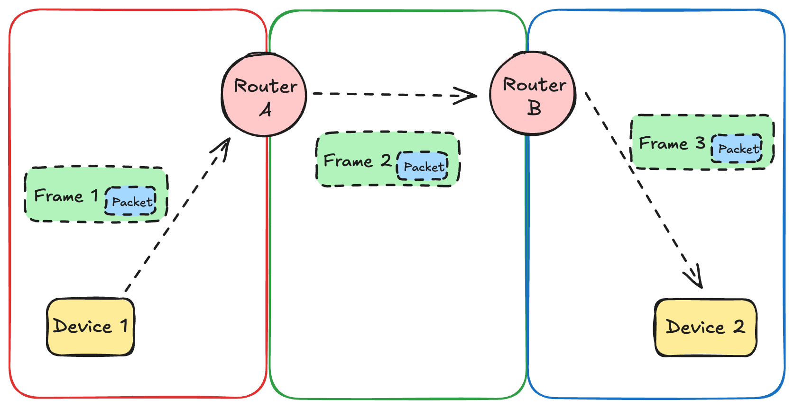
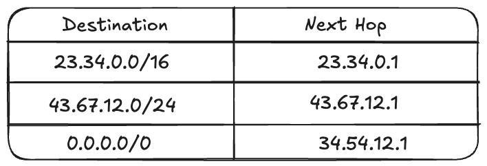

In the last blog, we looked at [Layer 1 and Layer 2](https://arshsharma.com/posts/2024-11-11-osi-layers-one-two/) of the OSI Model. While Layer 2 (Data Link Layer) adds a lot of improvements over Layer 1, like the ability to identify individual devices in the local network with the help of MAC addresses, it still only works best over local area networks (LAN). In this blog, let's see some shortcomings of Layer 2 and how Layer 3 of the OSI Model improves upon them.

## Problems with Layer 2

Layer 2 makes it easy to communicate between devices on the same network, but it has some problems when it comes to communicating between two different networks:

- MAC addresses aren't suitable for inter-network connectivity. Given a MAC address, there's no way to identify if it's of a device on the same local network or outside the network. Layer 3 fixes this with IP addresses (more on that soon).
- Layer 2 networks using a protocol, for example, Ethernet, can only be connected via the same protocol. This means if you need to communicate between two devices really far away using just a Layer 2 network, you'd need a really, really long Ethernet wire (or some very strong radio signals).

Since the internet connects different devices all across the globe, we need something more that fixes these problems. And this is where Layer 3 comes to save the day :)

## Layer 3 - Network Layer

Layer 3, or the Network Layer of the OSI model, is responsible for transferring data between devices on two different networks. Layer 3 has a few different protocols, but we'll limit our discussion to the most common one to make understanding this easier - and that's the [Internet Protocol](https://www.cloudflare.com/learning/network-layer/internet-protocol/) (IP).

Just like Layer 2 added MAC addresses, Layer 3 adds IP addresses, which are cross-network addresses and can be used to identify devices on a network outside of your Local Area Network (LAN). IP packets are moved from one source IP address to the destination IP address via a bunch of intermediate networks. Routers are the Layer 3 devices responsible for this.

## How IP Packets Move

Let's understand how routers move IP packets from one network to another. Let's take Router A and Router B, which are part of their local area networks that use Ethernet. When a device on Router A's local network needs to send some data to a device on Router B's network, it encapsulates that data in a frame and sends it to Router A via Layer 2. Router A takes the IP packet out of the frame and sees that it needs to be sent to Router B's network.

Now understand that while Router A and Router B are part of individual local networks, the two of them themselves also form a Layer 2 network, which might be connected by Wi-Fi (a different protocol than Ethernet). In this case, there are three Layer 2 networks:

- Router A and devices connected to it via Ethernet
- Router B and devices connected to it via Ethernet
- Router A and Router B connected via Wi-Fi

Each of these Layer 2 networks is using the same protocol to connect devices in that network, so it's not a problem.

So Router A again encapsulates the IP packet in a new frame and sends it to Router B via Layer 2 (using radio waves this time instead of Ethernet). Router B takes out the packet from the frame, sees it's for a device on its network, and puts it in a new Ethernet frame again to send it to the device. So, long story short, we keep changing the frame around the packet so that we can use a different protocol when we need to do cross-network communication. The IP packet itself never changes and remains constant throughout the journey.

## IP Packet Structure

There are two versions of the Internet Protocol that are being used: [IPv4](https://www.uptrends.com/what-is/ipv4) and [IPv6](https://www.cisco.com/c/en/us/solutions/ipv6/overview.html). We won't go into too much detail about their structures, but some important parts to know are:

- **Source IP Address**: IP address of the device that generates the packet.
- **Destination IP Address**: IP address of the intended destination for the packet.
- **Protocol**: IP is a Layer 3 protocol, which means the data contained in it is provided by Layer 4. This field stores which Layer 4 protocol was used. Examples are ICMP, TCP, UDP. This is important for the Layer 3 component at the destination to know which Layer 4 protocol to pass the data into.
- **Data**: This is provided by Layer 4.
- **Time to Live**: Since IP packets move between many different networks between the source and destination, it is important to define a maximum number of "hops" (jumps between different networks) they can make. If the limit is crossed and they're not able to reach their destination, they are discarded. If there is no such limit, then we would have a lot of stray IP packets.

The difference between IPv4 and IPv6 is that IPv6 has bigger addresses for source and destination. This allows more possible IPv6 addresses. Another difference is that Time to Live is called Hop Limit for IPv6. Both of them are the same functionality-wise, though.

## IPv4 Address Structure

Now let's understand what an IP address looks like. An example of an IP address is: `124.12.23.9`.

So basically four numbers, where each number can be from 0 to 255. Why 255? Because these are 8-bit numbers. And the biggest 8-bit number is `11111111` (all bits being 1), which in decimal notation is 255.

Okay, so now that we know what an IP address looks like, let's understand how devices know whether they need to move an IP packet to a local address or to a different network. This is where subnet masks come into play. These subnet masks are configured on Layer 3 devices along with IP addresses.

## Subnet Masks

There are two very common ways to denote a subnet mask. One is using dotted decimal notation like we saw for IP addresses above, and the other is using a [Classless Inter-Domain Routing](https://aws.amazon.com/what-is/cidr/) (CIDR) notation. Let's understand this with an example:

- Let's suppose the subnet mask is `255.255.0.0`, which in CIDR notation is written as `/16`. A subnet mask denotes which part of the IP address is reserved for the network and which is for the individual host machines. When converted to binary, the 1s in a subnet mask denote the network, whereas the rest are available for the hosts. So both `255.255.0.0` and `/16` translate to `11111111.11111111.00000000.00000000` (16 ones starting from the left). This means that given an IP address like `124.12.23.9`, the `124.12` part denotes the network, and `23.9` points to a specific machine.

Now I think you can start to see how machines identify whether the IP address is on their local network or part of another network. For the above example, an IP address from the range `124.12.0.0` to `124.12.255.255` means that the device is on the same network, whereas any device with an IP address where the network part isn't the same (for example, `111.12.0.3`) is on a different network.

## Default Gateway

On a local network of devices, the router (Layer 3 device) connected to the devices serves as the "Default Gateway" for those devices. That means whenever the devices don't know where to send the packet (that means it needs to be sent to a device not on the local network), they forward it to the router. Routers maintain a route table, which tells what the next hop or the target should be for a particular range of IP addresses. For example:

In this example above, packets intended for any IP addresses from `23.34.0.0` to `23.34.255.255` get forwarded to `23.34.0.1`, which then takes care of routing them forward to the final destination. If a route isn't in the table, then it matches `0.0.0.0/0` as the destination and is sent to a different network where another route table is responsible for making it reach its destination. And this is how packets hop from network to network and reach the device they're intended for.

Now we know that Layer 3 devices encapsulate IP packets in frames to be sent over Layer 2 networks. So how does the frame know what MAC address to take the packet to? This is where the Address Resolution Protocol (ARP) comes into the picture. The ARP components send a broadcast to all devices (FF-FF-FF-FF-FF-FF), basically asking which of them has that particular IP address. When the correct device receives it, it replies back with its MAC address. Then the Layer 3 IP packet is put inside a Layer 2 frame, which has the source and destination MAC addresses.

## Conclusion

Pheww. So I know we covered a lot in this one, but I do hope that you found it as fun and fascinating as I did when I was learning about all this stuff. It's pretty cool to understand how the things we take for granted (the internet) actually work behind the scenes. Take some time to digest this, and I'll see you in the next one, where we'll cover Layer 4 and Layer 5 of the OSI model. 🙂

Sign up for my newsletter to avoid missing when I upload a new blog!


<iframe
scrolling="no"
style="width:100%!important;height:220px;border:1px #ccc solid !important"
src="https://buttondown.email/arsh?as_embed=true"
></iframe>  
