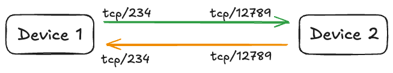
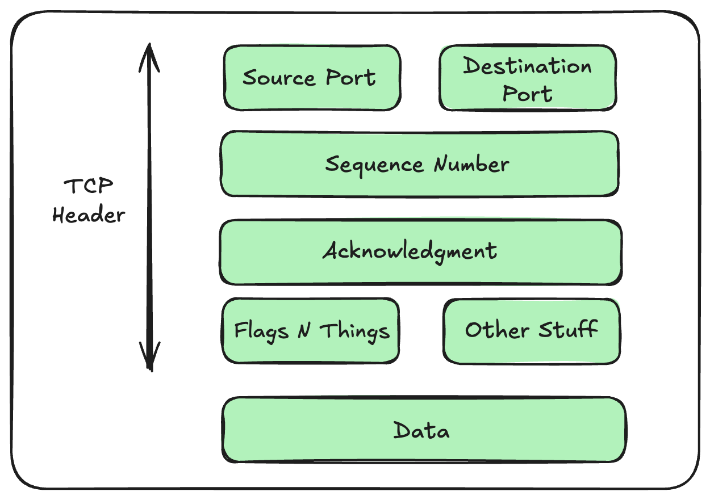
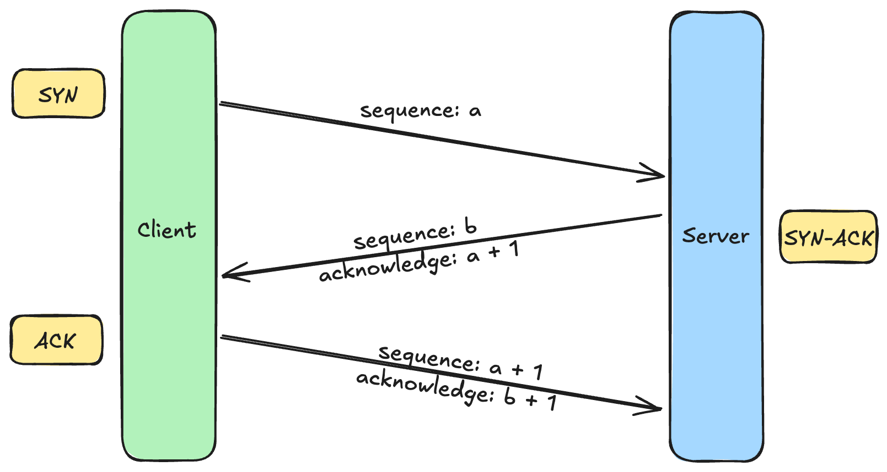
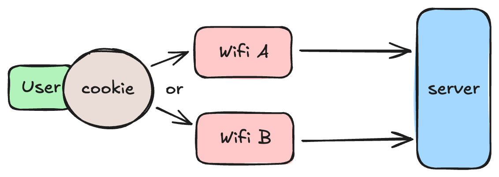
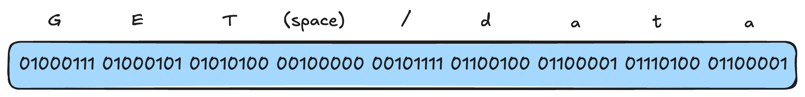

Welcome to the final blog in the series on the [OSI Model](https://arshsharma.com/posts/2024-11-11-osi-layers-one-two/). In the last blog, we discussed [Layer 3](https://arshsharma.com/posts/2024-11-25-osi-layer-three/) and how IP packets move from source to destination. In this one, we'll cover the shortcomings of Layer 3 and then discuss all the Layers from 4 to 7!

## Problems with Layer 3

While Layer 3 allows devices to communicate across different networks, there are still some problems that can occur with it.

- In an ideal world, [packets](https://arshsharma.com/posts/2024-11-25-osi-layer-three/#how-ip-packets-move) would reach their destination, but it's not uncommon for them to get lost. If you remember, we discussed in the last blog that packets have a time to live or hop limit after which they are discarded. So if, for any reason, a packet isn't able to reach the destination before this, it will be discarded and lost.
- It's not necessary for all packets to follow the same route. This means that different packets can reach the destination at different times and could be "out of order." This is a big problem if your application requires packets to be delivered in order, like, for example, when streaming a video over the internet, we need things to be delivered in sequence.
- Layer 3 doesn't offer separate communication channels. Packets have a source and destination IP but no way to differentiate them by app or channel. This means that if you have two applications running, there is no way to identify between the packets meant for one app vs. the other.

## Layer 4 - Transport Layer

Layer 4 fixes the problems we discussed above by building on top of Layer 3. Two common Layer 4 protocols are TCP (Transmission Control Protocol) and UDP (User Datagram Protocol). Both of them add features over IP (Internet Protocol). You'll often see "[TCP/IP](https://www.cloudflare.com/learning/ddos/glossary/tcp-ip/)" written in places, and what this means is that TCP (Layer 4) which is running on top of IP (Layer 3). Let's learn more about TCP to understand the benefits of Layer 4.

### TCP Segments

TCP introduces Segments, which are another container for data, just like [Packets](https://arshsharma.com/posts/2024-11-25-osi-layer-three/#ip-packet-structure) and [Frames](https://arshsharma.com/posts/2024-11-11-osi-layers-one-two/#layer-2---data-link-layer). Layer 4 takes data provided to it and chops that up into Segments, which are encapsulated in IP Packets. Segments have no information about the source and destination IP address; that is taken care of by the Packets which encapsulate them.

But just like Packets have Source and Destination IP Address, TCP Segments have Source and Destination Ports. Ports are what give the ability to have different channels of communication between the same devices. One application could be running on one port, whereas a different port can be used by another application. This way, when packets are decapsulated, the device knows which application to send the segment to based on the port number.

When using TCP, a connection is established between a random port on the client machine and a known port on the server. Once established, both can communicate with each other. Segments are what make this connection possible.

When you see this stream or channel between devices, it's important to understand that this channel isn't an actual channel but a way of visualizing things. The "channel" simply exists thanks to segments. From a Layer 4 perspective, we'll have two sets of segments. One with a source port of 234 and a destination of 12789 and the other with the reverse. From a Layer 4 perspective, these are two different things.

Segments also have a Sequence Number, which means their order can be identified and maintained. So even if packets arrive out of order, the segments can be reordered. This also means that if a packet isn't received for some reason, the destination machine can simply request for that sequence number, and another segment can be sent in a different packet by the source.

TCP Segments also have an Acknowledgment Number. This tells the sender what is the next byte expected by the receiver so that the sender can know the last received byte. In case an IP packet got "lost," then this way, the sender will know it wasn't received and will send it again.

Segments also have "Flags N Things." These are flags that can be set to make changes to the connection: things like closing the connection (FIN), synchronizing sequence numbers (SYN), and for acknowledgements (ACK). More on this in the next section. 

### TCP 3 Way Handshake

Before any data can be transferred using TCP, a connection needs to be established. And this uses a [three-way handshake](https://www.coursera.org/articles/three-way-handshake). The first step of this is the client sending a segment with a random sequence number to the server. The flag for this is SYN. The server then receives this segment and responds with its own segment. This segment that it responds with has its own random sequence number, but the acknowledgment number is the sequence number it received from the client + 1, effectively telling the client that that's the next sequence it expects. The flag for this is SYN ACK since it's used to synchronize sequence numbers but also to acknowledge the receipt of the client sequence number.

The client then receives this segment and then, to acknowledge to the server that it received that information, sends the corresponding sequence and acknowledgment numbers. This is of type ACK, basically acknowledging that things are good to go. At this point, both the client and server have acknowledged the initial sequence values sent by each other. And from this point on, data can flow between the two. Any time either side sends data, they increment the sequence by 1, and the other side acknowledges the sequence value + 1.

## Layer 5 - Session Layer

The lines start to get kind of blurry between Layer 4 and Layer 5. Layer 4 provides the foundation for a channel of communication, but Layer 5 builds on top of this and adds additional functionality. Layer 5 is responsible for establishing, maintaining, and terminating the communication sessions between applications. It introduces the concept of checkpoints, which basically ensure that if there is an interruption in a session for whatever reason, the session is able to resume from the last checkpoint instead of starting over. [Session Layer](https://www.javatpoint.com/session-layer-in-osi-model) also controls how the communication will proceed between the devices:

- simplex: one-way communication
- half-duplex: two-way communication that can only flow in one direction at a time
- full-duplex: simultaneous two-way communication

Some commonly used Layer 5 protocols are RPC (Remote Procedure Call), NetBIOS, and SMB (Server Message Block).

Another thing Layer 5 takes care of is distinguishing user sessions. Layer 5 is able to identify a user independent from the address of the layers below it, such as MAC address, IP address, and ports. A very common example of this is the cookies we see in modern browsers.

### How HTTP Cookies Work at Layer 5

Browser [HTTP cookies](https://developer.mozilla.org/en-US/docs/Web/HTTP/Cookies) are considered to be at Layer 5. They are responsible for managing and maintaining user sessions. Let's say you're connected to Wi-Fi A and then switch to Wi-Fi B. In doing so, your IP address and port both are likely to change. How is it still that you don't have to log in to whatever website you were already logged into? That's all thanks to cookies. 

Cookies are arbitrary text strings that store user information created by the server. When a user logs in to the website, the server generates one of these cookies and sends it to the user, and it stays with the user. So even when the user switches to a new Wi-Fi network with new Layer 2, 3, 4 information, that user still has the same cookie stored on their device. So the website can still identify this user independently of the Layer 2, 3, 4 address. This is one of the ways how Layer 5 plays a role in modern-day networking.

Do note that this is in the context of HTTP. HTTP uses HTTP cookies at Layer 5 to store user session info. A different protocol might have a different implementation (or none) for Layer 5. For example, FTP (File Transfer Protocol) has no implementation of Layer 5, which means it has no way of identifying user sessions other than IP address or ports. This implies that if your network changes, you'll have to log back in to the FTP server.

## Layer 6 - Presentation Layer

The Presentation Layer of the OSI model is all about how to interpret the raw data. The data received by Layer 6 is all in the form of 1s and 0s. It needs to know what protocol to use to interpret this data: it could be ASCII characters represented as binary, or it might be a JPEG file, or it could be JSON data. All of this translation to the correct data format is taken care of by Layer 6, which then passes this information to the Application Layer (Layer 7). This is really important because we want to make sure that the data sent by the Application Layer of one device is able to be read by the Application Layer of another device.

## Layer 7 - Application Layer

Layer 7 (the topmost layer!) of the OSI model provides the interface that users use to interact with the applications that have access to the network. It includes protocols like HTTP and HTTPS, which we use for browsing the web, FTP and TFTP for file sharing, SSH for remote access, among many others. To continue the example above, while Layer 6 converted the binary to ASCII characters, someone still needs to know what "G," "E," and "T" together mean and what action to take on seeing those. That is the role fulfilled by Layer 7.

## Conclusion

Congrats! You made it to the end of this three-part series on the [OSI Model](https://arshsharma.com/posts/2024-11-11-osi-layers-one-two/). I really hope you learned as much as I did when learning about this on my own. This series was a way for me to distill down in simpler terms the things I found confusing when studying the OSI model. One final thing I want you to take away from this is that you shouldn't get too caught up in putting things into layers when you come across networking concepts. Fussing about what belongs in which layer isn't the point of this model. The OSI model is meant to help you visualize how two devices can communicate across the internet, and the biggest takeaway for you should be the concept of abstraction in this model: how each layer has a responsibility, and that means the other layers can abstract over it and not worry about that responsibility.

Thanks for reading! If you found this series useful, consider signing up for my newsletter to get notified whenever I post something!


<iframe
scrolling="no"
style="width:100%!important;height:220px;border:1px #ccc solid !important"
src="https://buttondown.email/arsh?as_embed=true"
></iframe>  
