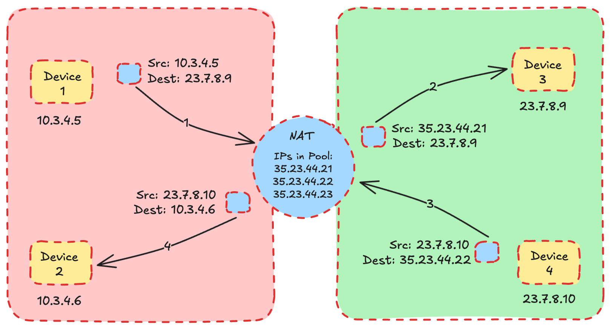
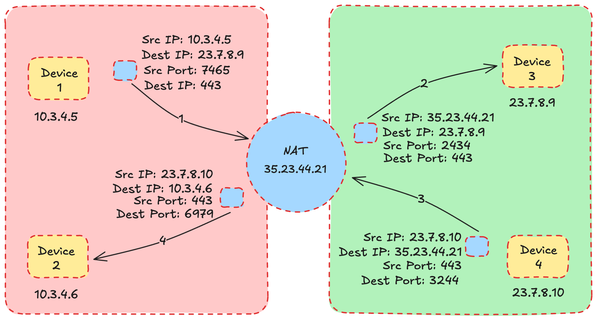

If you've been [following my blog](https://arshsharma.com/writing/), you know I recently wrote a three-part series on the [OSI Model](https://arshsharma.com/posts/2024-11-11-osi-layers-one-two/). Continuing that trend of networking blogs, in this one, I'll be covering a very important topic in the world of networking, and that's NAT (Network Address Translation). I promise this is easier to understand than the OSI Model haha :P

## The Problem That NAT Solves: Shortages of IPv4 Address

Before we learn about what NAT is and does, it's important to discuss why we even need it in the first place. [IPv4 addresses](https://arshsharma.com/posts/2024-11-25-osi-layer-three/#ipv4-address-structure) can be either publicly routable or in the private address space for IPv4. Publicly routable addresses are assigned by [The Internet Assigned Numbers Authority](https://www.iana.org/) (IANA) to [ISP](https://www.techtarget.com/whatis/definition/ISP-Internet-service-provider)s, which then further allocate them to end users like AWS or even you or me. These publicly routable addresses need to be unique for the internet to function correctly.

On the other hand, private address space for IPv4 only has to be unique over that particular private network and can be reused across multiple private networks. They include the following ranges: `10.0.0.0/8`, `172.16.0.0/12`, and `192.168.0.0/16`. If you're not sure how to interpret this range, you should check out [this particular section](https://arshsharma.com/posts/2024-11-25-osi-layer-three/#subnet-masks) in my previous blog where I explain this. Being able to assign reusable private addresses to devices instead of a unique publicly routable IP address to each device helps overcome the shortage of limited IPv4 addresses.

But what do we do when a device with a private IP address wants to talk to a device on the public internet? This is the problem that NAT solves. NAT takes a private IP address and figures out how to translate it to a public IP address so that packets can flow over the internet and back to the device in the private network. So NAT basically allows devices on a private network to not occupy the limited number of unique public IP addresses yet still be able to communicate with the internet.

Let's see the different types of NATs as that will help you understand them better.

## Static NAT

Now this would seem counterintuitive to the discussion we were having about how NAT solves the problem of limited IPv4 addresses, but just imagine that you had somehow acquired a bunch of public IPv4 addresses - more than or equal to the number of devices you have on your private network. Well, in this case, you could simply just assign each device a public IP whenever it wants to communicate with the internet.

The device would send an IP packet to the default gateway (the router), and then the router would have a NAT Table that has a 1:1 mapping of `private IP` : `public IP`. So it will modify the source IP of this packet to a publicly addressable one and send it to the destination. When the destination sends a response back, the NAT device will again do the translation from the IP the destination device used and translate it back to the private IP of the original source device.

Here's what the NAT table for this would look like:

| Private IP | Public IP   |
|------------|-------------|
| 10.3.4.5   | 35.23.44.21 |
| 10.3.4.6   | 35.23.44.22 |

Now you might be wondering, if we have extra public IPs, why not assign them to devices instead of using private IPs and a NAT. Well, there are a couple of reasons for that. First is security. Static NAT offers isolation between the private network and the public internet. Devices have their private IPs, which they can use to communicate internally, and the NAT device comes into the picture when some external communication is required. If you assign public IPs to all devices, then they will be communicating over the public internet with each other as well, thus increasing the attack surface for your network. The other reason is that public IPs can change due to ISP updates, and if you're using them, that would mean you have to reconfigure every device on your network. With a static NAT, you only need to change the NAT configuration, which is much more convenient.

## Dynamic NAT

Dynamic NAT is pretty similar to Static NAT, with the difference being that devices aren’t allocated a fixed permanent IP. Instead, there is a pool of public IPs, and one gets allotted temporarily to the device that needs it. The `private IP` : `public IP` mapping is temporary. That means two devices could share the same public IP but at different times. But it also means that if all the IPs in the pool of public IPs have already been allocated and a device tries to communicate with the internet, there won’t be any IPs left to assign to it, and it will fail to access the internet.

## Port Address Translation

Port Address Translation is my favorite type of NAT. It allows a large number of private devices to share one public IP address. This is likely what’s being used on your home network as well.

If the name didn’t already give you a hint, PAT uses ports to manage multiple private IP addresses and map them to a single public IP address. Any time a packet reaches the NAT device, it assigns it the one public IP it has available and a random port (refer to the [blog on Segments](https://arshsharma.com/posts/2024-11-28-osi-layer-four-seven/#tcp-segments) if you aren’t familiar with ports). This random port is what allows multiple devices, even with the same IP, to communicate with the public internet while still being seen as different devices. If the port number were the same for all these devices, then there would’ve been no way to differentiate between the traffic addressed to each device, and this wouldn’t work.

Here’s what a NAT table looks like when using Port Address Translation.

| Private IP | Private Port | Public IP   | Public Port |
|------------|--------------|-------------|-------------|
| 10.3.4.5   | 7465         | 35.23.44.21 | 2434        |
| 10.3.4.6   | 6979         | 35.23.44.21 | 3244        |

This NAT table maintains the extra fields related to the private (original) port and public (assigned) port for each device in addition to the IP fields we saw in the NAT table for Static NAT. It then does the appropriate translation for the packets as they come and go.

## Conclusion

In this article, we studied what Network Address Translation is, what problems it solves, and the three common types of NATs. I hope you now have an understanding of how different NAT types work and when each of them is useful. I’ll be covering a couple of other networking topics in the coming blogs, so subscribe to my newsletter if you’re interested in remaining up to date about them!


<iframe
scrolling="no"
style="width:100%!important;height:220px;border:1px #ccc solid !important"
src="https://buttondown.email/arsh?as_embed=true"
></iframe>  
