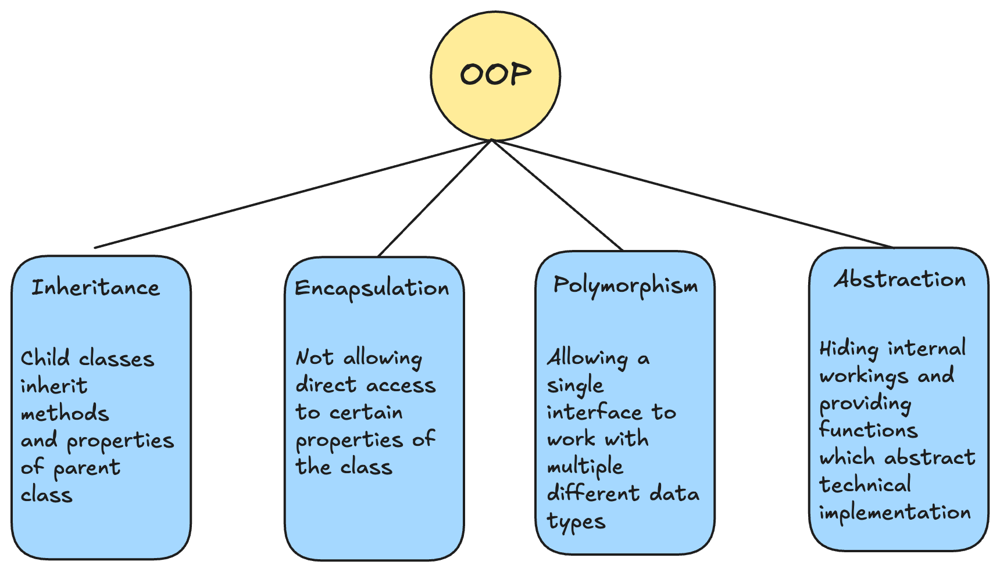

When we talk about programming, we usually mean writing a bunch of functions that modify and interact with some data. Object Oriented Programming (OOP) is a programming model that instead focuses on “objects” that contain data and and have some relevant functions attached to them. Object Oriented Programming has four pillars: Inheritance, Encapsulation, Polymorphism, and Abstraction. In this blog, we’ll take a look at how you can implement each of them in Golang with examples. Some basic idea about OOP is recommended, but if not, I will be giving a brief introduction to what all the four pillars mean.



## Classes, Objects, and Methods

The core idea of Object Oriented Programming can be summed up in these bullet points:

- You define "classes" which are a collection of data and functions you can call on that data.
- These specific functions are called "methods" of that particular class.
- An actual instance of a class is called an "object."

Let's look at some code in Golang to understand these three concepts:

```go
package main

import "fmt"

type Batman struct {
	actor string
	year  int
}

func (b Batman) SayImBatman() {
	fmt.Printf("I'm %s and I'm Batman from year %d\\n", b.actor, b.year)
}

func main() {
	b1 := Batman{actor: "Michael Keaton", year: 1989}
	b2 := Batman{actor: "Christian Bale", year: 2005}

	b1.SayImBatman()
	b2.SayImBatman()
}
```

In Golang, classes are nothing but [types](https://www.practical-go-lessons.com/chap-13-types#how-to-create-new-types-type-definition) defined by us. These types don't necessarily have to be a [struct](https://gobyexample.com/structs) but usually they are since in OOP we work with a collection of data, which could be of any type (string, int, etc.).

Classes are blueprints for objects. Whenever you instantiate a class, an object is formed. In this example, `b1` and `b2` are objects of the Batman class.

The `SayImBatman` function can be called on any object of the class. Since it's tied to the Batman class, instead of calling it a regular function, it's called a *method of the class*.

I feel this should clear out the basics of OOP enough for you to move on to the next section, where we look at the four pillars of OOP.

## Inheritance

Inheritance introduces the concepts of *parent* and *child* classes in OOP. A child class is a class derived from a parent class and inherits all its methods and properties (data). Let us look at some code which will help us understand this:

```go
package main

import "fmt"

type Hero struct {
	team string
}

type Batman struct {
	Hero
	name string
}

type Ironman struct {
	Hero
	power int
}

func (h Hero) SayTeam() {
	fmt.Println("My Team is", h.team)
}

func (b Batman) SayImBatman() {
	fmt.Printf("I'm %s and I'm Batman\\n", b.name)
}

func (i Ironman) SayPowerLevel() {
	fmt.Printf("I'm Ironman and my powerlevel is %d\\n", i.power)
}

func main() {
	b1 := Batman{Hero{team: "Justice League"}, "Christian Bale"}
	i1 := Ironman{Hero{team: "Avengers"}, 23}

	b1.SayImBatman()
	b1.SayTeam()

	i1.SayPowerLevel()
	i1.SayTeam()
}
```

In this example, Batman and Ironman are child classes of the Hero parent class. They have access to their parent class's properties, that is, `team`, and its methods, that is, `SayTeam`. Like you can see when declaring the `b1` and `i1` instances, we specify the parent class properties as well as their specific properties for respective classes. Both of them are able to call the `SayTeam` method that is defined on the parent class. But they also have separate properties and methods which are unique to each of them.

Golang implements inheritance using [composition](https://www.codecademy.com/resources/docs/go/composition) (using a struct inside a struct). It doesn't have inbuilt class based inheritance like other OOP languages such as C++ or Java.

## Encapsulation

Encapsulation is the principle of hiding an object's internal properties and not allowing them to be modified directly. Instead, it relies on providing methods to get and update these properties. Let's look at an example to understand this better:

```go
//oops-in-go/utils/utils.go

package utils

type Batman struct {
	actor string
	year  int
}

func (b *Batman) GetActor() string {
	return b.actor
}

func (b *Batman) GetYear() int {
	return b.year
}

func (b *Batman) SetActor(actor string) {
	b.actor = actor
}

func (b *Batman) SetYear(year int) {
	b.year = year
}
```

```go
// oops-in-go/main.go

package main

import (
	"fmt"
	"oops-in-go/utils"
)

func main() {
	b1 := utils.Batman{}
	b1.SetActor("Michael Keaton")
	b1.SetYear(1989)
	fmt.Printf("I'm %s and I'm Batman from year %d\\n", b1.GetActor(), b1.GetYear())

	b1.SetActor("Christian Bale")
	b1.SetYear(2005)
	fmt.Printf("I'm %s and I'm Batman from year %d\\n", b1.GetActor(), b1.GetYear())
}
```

In Golang, properties and methods that are exported out of the package begin with a capital letter. When we define `actor` and `year` with a lowercase in the `utils` package, we ensure that they can't be modified directly. Instead, like you see in the `main.go` file, you need to use the exported methods (which begin with a capital letter) - `GetActor`, `SetActor`, etc., to fetch and modify them.

This is what encapsulation is all about - making sure that you prevent accidental changes to data and instead provide methods to safely interact with the data.

One thing you'll notice different is that in all the methods for the Batman class, we're using a pointer receiver `*Batman` instead of a value receiver `Batman` like we were in the earlier examples. This is because we want to be able to modify the original struct in the `Set` methods. And in Golang, it's best practice that if some methods need a pointer receiver, you make all the methods use a pointer receiver for consistency. That's why the `Get` methods are using a pointer receiver as well even though they aren't modifying the original struct.

Also, one more thing to note is that just because we're using a pointer receiver, we don't have to do this: `(&b1).GetActor`. In Golang, functions with a pointer argument must take a pointer, but methods with a pointer receiver can either take a value or pointer as the receiver.

TL;DR: Golang automatically translates `b1.GetActor` as `(&b1).GetActor` since the `GetActor` method has a pointer receiver, but it would not translate `GetActor(b1)` to `GetActor(&b1)` had the `GetActor` been a normal function taking a pointer argument.

## Polymorphism and Abstraction

The next two pillars of OOP can be clubbed because the code samples for them would look pretty similar. Polymorphism refers to the programming practice where two different objects of two different classes can be treated as objects of the same common superclass. That means you can call the same function on two different objects as if they were objects of the same class. This should start giving you a scent of [interfaces](https://go.dev/tour/methods/9) being involved :)

Let's look at some code to understand this better:

```go
package main

import "fmt"

type Hero interface {
	Fight()
}

type Batman struct {
	weapon string
}

type Ironman struct {
	weapon string
}

func (b Batman) Fight() {
	fmt.Printf("Batman hits with a %s\\n", b.weapon)
}

func (i Ironman) Fight() {
	fmt.Printf("Ironman hits with a %s\\n", i.weapon)
}

func StartFight(h Hero) {
	fmt.Println("Fight has started.")
	h.Fight()
}

func main() {
	b1 := Batman{"Batarang"}
	i1 := Ironman{"Repulsor rays"}

	StartFight(b1)
	StartFight(i1)
}
```

In this example, the `StartFight` function can be passed both the `b1` and `i1` objects even though they are related in no way to each other. Try to understand how this is different from Inheritance, where the child classes had access to the parent class's *methods*. In this example, there are no child and parent classes (and no methods being shared as well). Instead, two different objects are being treated as the same by a *function*: this is called Polymorphism.

Now, this can also be treated as an example of Abstraction. Abstraction, like the name suggests, is the programming practice of hiding away implementation details and instead just providing functions that take care of things for you. In this example, you don't need to care how the individual hero's methods are configured. You can continue using the `StartFight` function anytime you want to use any of the heroes' `Fight` function. This way, the implementation details remain hidden from the user, and only the essential details are exposed.

Now coming back to Polymorphism, there are two more common examples, and those are method overriding and overloading.

### Method Overriding

Method overriding refers to child classes defining their own implementation of methods defined on the parent class. This implementation now gets used instead of the original parent class's implementation. Let's take the code we used for inheritance earlier and see how it looks with method overriding:

```go
package main

import "fmt"

type Hero struct {
	team string
}

type Batman struct {
	Hero
	name string
}

type Ironman struct {
	Hero
	power int
}

func (h Hero) SayTeam() {
	fmt.Println("My Team is", h.team)
}

func (b Batman) SayImBatman() {
	fmt.Printf("I'm %s and I'm Batman\\n", b.name)
}

func (i Ironman) SayPowerLevel() {
	fmt.Printf("I'm Ironman and my powerlevel is %d\\n", i.power)
}

func (b Batman) SayTeam() {
	fmt.Printf("I'm Batman and my team is %s\\n", b.team)
}

func main() {
	b1 := Batman{Hero{team: "Justice League"}, "Christian Bale"}
	i1 := Ironman{Hero{team: "Avengers"}, 23}

	b1.SayImBatman()
	b1.SayTeam()

	i1.SayPowerLevel()
	i1.SayTeam()
}
```

The output of this program is:

```
I'm Christian Bale and I'm Batman
I'm Batman and my team is Justice League
I'm Ironman and my powerlevel is 23
My Team is Avengers
```

The objects of the Batman class now use their own `SayTeam` method instead of that of the parent Hero class. Since the Ironman class has no `SayTeam` method of its own, its object still uses the method of their parent class. This is what Method Overriding means, child classes "overriding" the methods defined on the parent class.

### Method Overloading

This refers to the same function being able to take multiple different arguments. These arguments could be different in number or type. Golang provides two ways to achieve this: through variadic functions and the other through interfaces.

Let's look at the code for both, which will help you understand better:

#### Using Variadic Functions

```go
package main

import "fmt"

func listMembers(team string, members ...string) {
	for _, member := range members {
		fmt.Printf("I'm %s and I'm part of the %s\\n", member, team)
	}
}

func main() {
	listMembers("Justice League", "Batman", "Superman", "Flash")

	listMembers("Avengers", "Ironman", "Captain America")
}
```

Here you can "overload" the `listMembers` function with any *number* of arguments.

#### Using Interfaces

```go
package main

import "fmt"

func saySomething(batman interface{}) {
	switch b := batman.(type) {
	case string:
		fmt.Printf("My name is %s and I'm Batman\\n", b)

	case int:
		fmt.Printf("My powerlevel is %d and I'm Batman\\n", b)

	default:
		fmt.Println("I'm Batman")
	}
}

func main() {
	saySomething("Christian Bale")
	saySomething(42)
	saySomething(12.3)
}
```

The output of this program is:

```
My name is Christian Bale and I'm Batman
My powerlevel is 42 and I'm Batman
I'm Batman
```

Here we are "overloading" the `saySomething` method to take arguments of different types. We take an empty interface as an argument, which could be any type, and then check for its type using a switch case and print the output accordingly.

## Conclusion

I'm well aware that this was a lengthy read, and if you stuck till the end, I want you to know I'm really happy :) I sincerely hope you learned a lot of new things about Object-Oriented Programming and how to implement it in Golang. I write blogs on different technical concepts on my website, and if you're interested in learning new things, I'd recommend signing up for my newsletter.


<iframe
scrolling="no"
style="width:100%!important;height:220px;border:1px #ccc solid !important"
src="https://buttondown.email/arsh?as_embed=true"
></iframe><br /><br />
