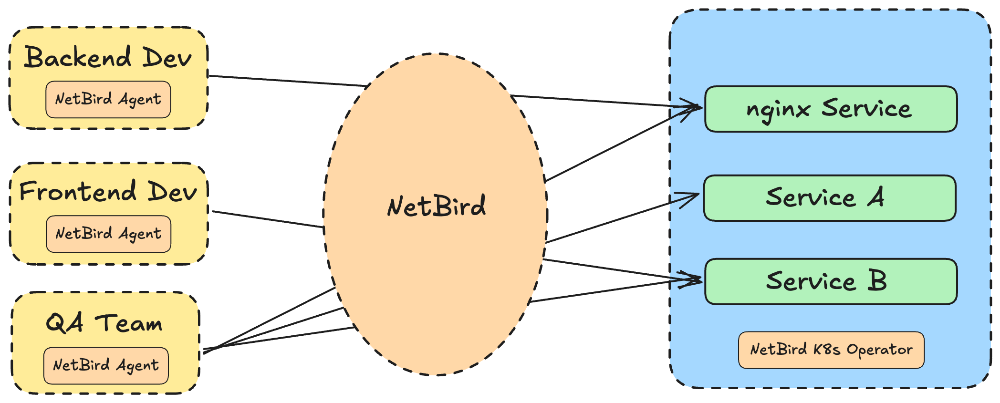
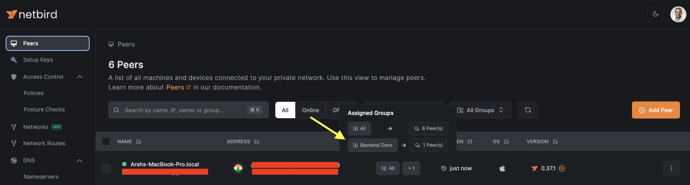
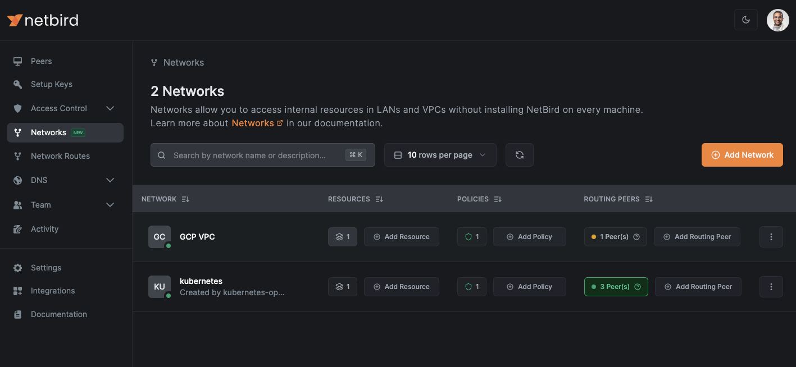
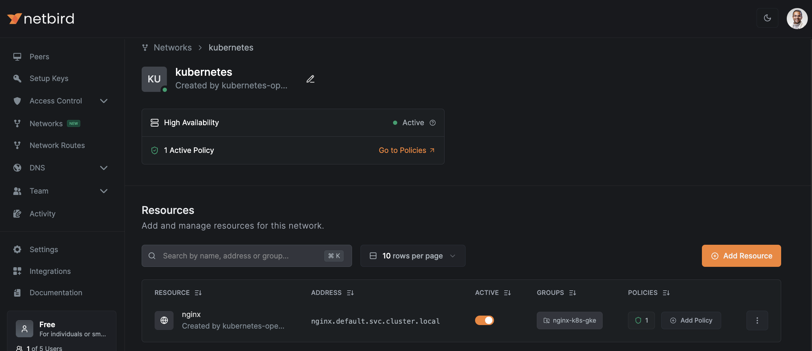
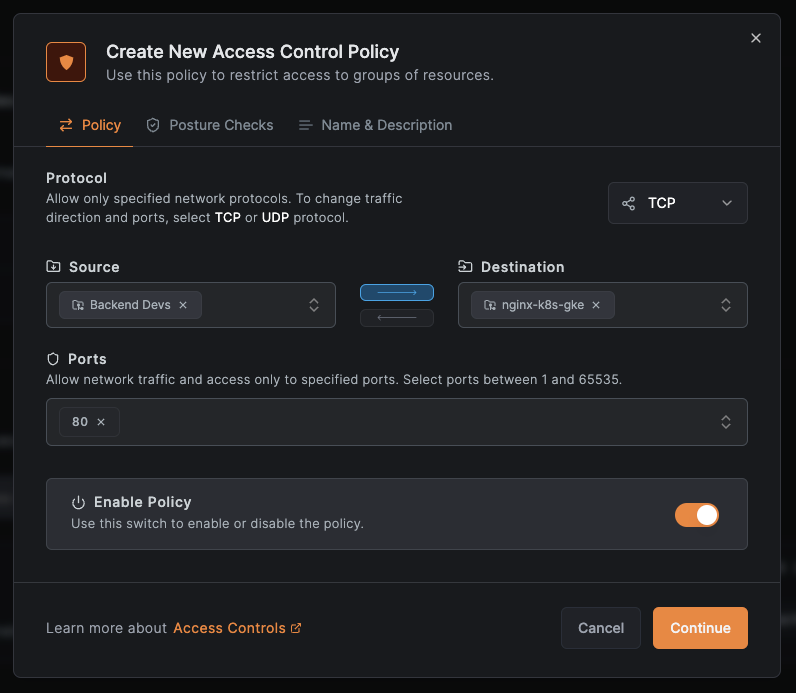
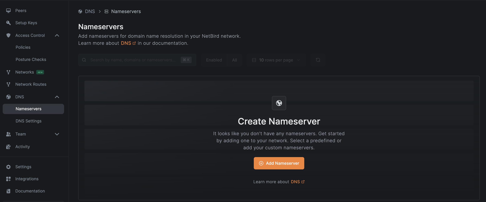
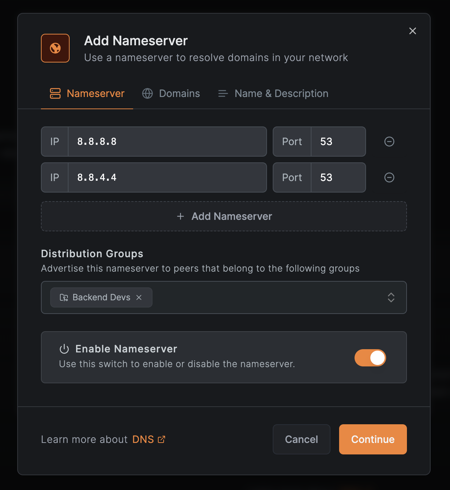
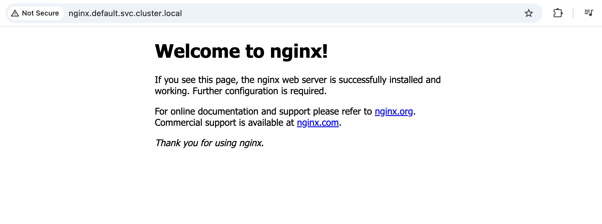
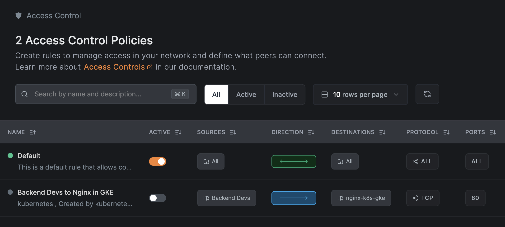
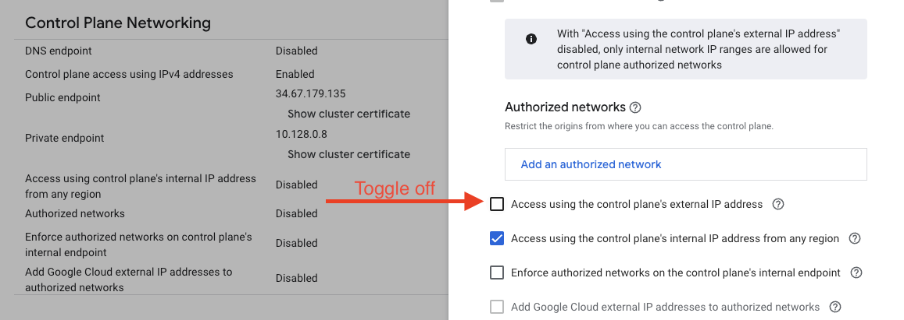

Kubernetes is complex. Securing Kubernetes clusters is even more complex. Striking the right balance between granting developers and administrators access to Kubernetes clusters and services while taking care of security is a significant challenge. [Overlay networks](https://www.techtarget.com/searchnetworking/definition/overlay-network) offer a solution by providing secure, controlled access to your clusters without compromising their protection. In this blog, we'll explore the challenges of providing secure access to Kubernetes clusters, how overlay networks can address these issues, and a step-by-step tutorial on implementing this using [NetBird](https://netbird.io/), an open-source [WireGuard](https://www.wireguard.com/)-based overlay VPN.

## The Challenges of Providing Secure Remote Access to Kubernetes Clusters

Your organization might have different Kubernetes clusters for different needs: development, staging, testing, and production. Configuring who can access which cluster or which services on a particular cluster can be a really complicated process. It would also require you to work around the existing firewall rules your IT team might have set in place. Safe to say, it's not a fun experience.

But why is it important to have this type of fine-grained access?

- **Reducing the Attack Surface**: Allowing everyone to have full access to all clusters and all services is a recipe for disaster. You're basically increasing the attack surface for things to go wrong. Even if you don't get attacked, you are still prone to accidents. For example, someone on your team accidentally making a change to a different cluster or service than the one they're responsible for, leading to costly downtime or data loss.
- **Simplifying Access for Non-Developers**: There are scenarios where stakeholders other than developers and administrators (e.g., QA testers or product managers) need access to specific services in staging or testing environments. Setting up and remembering to revoke firewall rules for such users can be cumbersome and prone to oversight, creating potential security risks.
- **Securing Staging and Testing Clusters**: Staging and testing clusters should not be exposed to the public internet. However, developers still need secure access to these environments to perform their tasks. Traditional methods of providing this access are often complicated and insecure.

All these are reasons to establish a way to provide fine-grained access to your Kubernetes clusters and the services they're running. Everyone should be able to access what they need but nothing more. At the same time, you need a way to respect your existing firewall and networking rules instead of having to modify them each time a different person or team needs access. The good part is that an overlay network like NetBird makes all of this really easy!

## What Are Overlay Networks?

Overlay networks are virtual networks that operate on top of your existing physical network infrastructure. [NetBird](https://netbird.io/use-cases/remote-access), for example, is an overlay network built on [WireGuard](https://en.wikipedia.org/wiki/WireGuard) technology. It enables secure remote access and connectivity between different parts of your infrastructure (whether it's on-premises, your local machine, in a cloud provider, or anywhere else) without requiring changes to existing firewall rules.

This is achieved by leveraging peer-to-peer communications, which means devices in the overlay network can communicate directly with each other through encrypted tunnels. This provides a secure and efficient way to connect your infrastructure while maintaining isolation from the underlying physical network. Let's understand this visually by taking the example of providing access to a Kubernetes cluster securely.



In this case, as you see, we run the NetBird agent on the developers' machines, and we have the NetBird Kubernetes operator running in the cluster. The NetBird control plane then takes care of ensuring secure peer-to-peer communication between each of the machines and the services on the cluster. You can configure which machine (or sets of machines) have access to which services without giving everybody full access to the cluster. You can also also specify:

- What ports can be accessed by what groups of machines
- What geolocations are allowed access
- What operating systems are allowed access (example: macOS devices only)

NetBird does all of this with the help of [Posture Checks](https://docs.netbird.io/how-to/manage-posture-checks). The best part is that since this is an overlay network, it respects any existing firewall or network rules you already have in place and doesn’t require you to modify them.

## Securing Remote Access to Kubernetes Clusters

Now, let’s walk through the step-by-step process of configuring secure remote access from a developer’s machine to a service running in a Kubernetes cluster using NetBird. There are a few things you'll need to follow along:

- A Kubernetes cluster. I'm going to be using a [GKE](https://cloud.google.com/kubernetes-engine?hl=en) cluster, but feel free to use any cloud provider.
- A NetBird cloud account. This is completely [free to get started](https://docs.netbird.io/how-to/getting-started) with, and the setup process hardly takes 5 minutes.

### Installing the NetBird Kubernetes Operator

Once you're done with the above prerequisites, we can begin installing the NetBird Kubernetes operator on the cluster. The first thing you need to do is add the Helm repository where the NetBird operator chart is:

```bash
helm repo add netbirdio <https://netbirdio.github.io/kubernetes-operator>
```

The NetBird operator requires [cert-manager](https://cert-manager.io/) in order to communicate with the Kubernetes API. You can install the latest version of cert-manager by following the instructions [here](https://cert-manager.io/docs/installation/). One thing I would recommend before proceeding is using the [cmctl CLI](https://cert-manager.io/docs/reference/cmctl/#installation) to check if the cert-manager API is ready or not.

```bash
kubectl apply -f <https://github.com/cert-manager/cert-manager/releases/download/v1.17.0/cert-manager.yaml>
```

After that, we need an API token to connect this operator to our NetBird account. You can find instructions on how to create a service account user and generate a token for it in the [docs here](https://docs.netbird.io/how-to/access-netbird-public-api#creating-a-service-user).

Once you've generated your token, copy it and put it in a file named `nb-pat.secret`.

Now we're ready to create a [Kubernetes Secret](https://kubernetes.io/docs/concepts/configuration/secret/) which stores this token in a new namespace called `netbird`. We'll be installing the NetBird operator in this same namespace later. The operator would be reading the API token from this secret we create:

```bash
kubectl create namespace netbird
kubectl -n netbird create secret generic netbird-mgmt-api-key --from-literal=NB_API_KEY=$(cat ./nb-pat.secret)
```

After this, create a `values.yaml` which has the configuration for the operator we're going to install. Here's a minimal configuration to help you get started:

```yaml
ingress:
  enabled: true
  router:
    enabled: true

netbirdAPI:
  keyFromSecret: "netbird-mgmt-api-key"
```

You can run `helm show values netbirdio/kubernetes-operator` to get complete information on all the fields you can configure in this file. What the above configuration does is first enable `ingress` so that we're able to expose services from our cluster.

Enabling `routing` deploys [routing peers](https://docs.netbird.io/how-to/routing-peers-and-kubernetes) in the form of Kubernetes pods in the NetBird namespace. These routing peers are what allow access between your machine and the services on the cluster. By default, if you enable them, NetBird will create three of these so that you have high availability and even if one of them fails, your connection isn't interrupted.

Once you've created this file, it's now time to install the operator by running:

```bash
helm install --create-namespace -f values.yaml -n netbird netbird-operator netbirdio/kubernetes-operator
```

Once the installation is complete check if everything is working correctly or not by running:

```bash
kubectl get pods -n netbird
```

### Deploying a service

Once we have the operator installed, let's deploy an [Nginx](https://nginx.org/) deployment and create a Kubernetes service for it. We expose the Nginx deployment using the `ClusterIP` service type in Kubernetes. By default, `ClusterIP` restricts access to the service from **within** the cluster only, meaning it won't be accessible from outside the cluster. Later in this guide, we'll see how to enable secure external access to this service from our local machine using NetBird (without changing the service type). For now, deploy the following Kubernetes configuration which creates an Nginx deployment and a service for it:

```yaml
# nginx.yaml
apiVersion: apps/v1
kind: Deployment
metadata:
  labels:
    app: nginx
  name: nginx
  namespace: default
spec:
  replicas: 1
  selector:
    matchLabels:
      app: nginx
  strategy:
    rollingUpdate:
      maxSurge: 25%
      maxUnavailable: 25%
    type: RollingUpdate
  template:
    metadata:
      labels:
        app: nginx
    spec:
      containers:
        - image: nginx
          imagePullPolicy: Always
          name: nginx
---
apiVersion: v1
kind: Service
metadata:
  annotations:
    netbird.io/expose: "true"
    netbird.io/policy: default
    netbird.io/resource-name: nginx
    netbird.io/groups: nginx-k8s-gke
  labels:
    app: nginx
  name: nginx
  namespace: default
spec:
  ports:
    - name: http
      port: 80
      protocol: TCP
      targetPort: 80
  selector:
    app: nginx
  type: ClusterIP
```

I want to call out your attention to the annotations for the service we create. This is what the following annotations do:

- `netbird.io/expose: "true"` - This tells the operator that this service is to be exposed by NetBird. Any service that doesn't have this annotation won't be discovered by NetBird, and you'll not be able to access it in the NetBird console.
- `netbird.io/policy: default` - This specifies the default policy to apply to the service. Policies in NetBird define who can access the service and under what conditions.
- `netbird.io/resource-name: nginx` - This is what the name of the service will be shown as in the NetBird console. We'll see a screenshot which shows this later.
- `netbird.io/groups: nginx-k8s-gke` - This specifies what group the service belongs to in the NetBird console. [Groups](https://docs.netbird.io/how-to/manage-network-access#groups) in NetBird are a way to club different resources together based on things like which teams are responsible for taking care of them, which application they belong to, etc.

Create the Nginx deployment and service by running:

```bash
kubectl apply -f nginx.yaml
```

Once you have the service created, it's now time to head over to the NetBird console and configure a secure connection from our dev machine to this service.

### Establishing a secure connection with the deployed service

In many cases, developers need access to a service running inside a Kubernetes cluster (like the one we deployed) to test functionality from their local machines. However, exposing internal services publicly is not ideal due to security concerns. This is where an overlay network solution like NetBird comes in, allowing developers to securely connect to internal services without opening them up to the internet or modifying the service type itself.

I'll demonstrate how to establish a secure connection to the Nginx service from your own local machine. However, it's worth noting that NetBird allows you to provide access to this service from multiple machines which could belong to different developers in your organization.

The first step is to install the NetBird agent on the machines that need access. Since I'm using macOS, I followed the [installation instructions](https://docs.netbird.io/how-to/getting-started#install-net-bird) for Mac. Once installed, your local machine should appear in the "Peers" section of the NetBird console. I created a [Group](https://docs.netbird.io/how-to/manage-network-access#groups) called "Backend Devs" and added my machine to it.



#### Creating an Access Policy

Next, navigate to the "Networks" section in the NetBird console:



Here, you'll see a network named `kubernetes`, which was automatically created by the NetBird operator when it was installed in the cluster. [Networks](https://docs.netbird.io/how-to/networks) in NetBird simplify secure communication with resources in scenarios where installing the NetBird agent isn't feasible for each resource. For example, by creating a network for the entire cluster, we can easily establish secure communication with individual services within the cluster. This means that any device with the NetBird agent installed can securely access the services running in the cluster (given it has the required permissions) without requiring additional configuration for each service from our side.

Once you open the `kubernetes` network, you'll see the `nginx` service as a resource. You'll also see that it gets automatically assigned to a group called `nginx-k8s-gke`, which is what we specified in the annotations when creating the service.



The next step for us is to create a policy that allows access to this service from our local machine.

Now, when you click the "Add Policy" button for the Nginx resource, the following popup should show up:



Here, I've selected "Backend Devs" as the source group. This is the group that has our local machine in it. The advantage of using [Groups](https://docs.netbird.io/how-to/manage-network-access#concepts) is that you can easily add or remove different developers' machines without modifying the policy itself. For the destination, I selected the `nginx-k8s-gke` group, which has the deployed Nginx service. I chose TCP as the protocol and opened port `80`, which is the port the Nginx service listens on.

It's important to note that the policy is configured for one-way communication: from the "Backend Devs" group to the Nginx service. This ensures that the service cannot initiate connections back to the local machines, which is a security best practice. NetBird excels in providing fine-grained access control, allowing you to define exactly what is needed and nothing more.

Finish creating the policy by clicking continue and giving it an appropriate name.

#### Adding a Nameserver

At this point, the Nginx service is accessible, but its address (`nginx.default.svc.cluster.local`) needs to be resolvable from the local machines. To enable this, we'll configure a DNS resolver in NetBird. Navigate to the "Nameservers" section under DNS and click "Add Nameserver":



Since our cluster is in GKE, choose Google DNS, and in the configuration for the nameserver, make sure to add the "Backend Devs" under distribution groups. Leaving everything else as it is, continue creating the nameserver.



One final thing you need to do is enable DNS wildcard routing in your NetBird settings. The steps for that can be found [here](https://docs.netbird.io/how-to/networks#enable-dns-wildcard-routing).

#### Testing the Connection

Once this is done, head over to the `nginx.default.svc.cluster.local` URL in your browser. You should see the default Nginx welcome page:



To verify the security of the setup, go back to the "Policies" section in the NetBird console (under Access Control) and disable the policy you just created. After doing so, you'll no longer be able to access the Nginx service from your local machine.



Now, you can even disable access to your cluster using the external public endpoint in the GKE settings, and you'll still be able to access the service from all machines that have the NetBird agent installed and are part of the "Backend Devs" group.



This approach is a recommended security best practice for clusters where public access isn't necessary, such as those used for development, testing, or staging environments.

## Conclusion

I think now you can start to see the benefits of using an overlay network like NetBird to securely access resources and services in a Kubernetes cluster. As your organization grows, managing access to different clusters and services for different teams can become complex. NetBird simplifies this process by allowing you to create groups for teams and grant them access only to the things they need. This approach significantly reduces the attack surface and minimizes the potential for things to go wrong.

As a next step, I recommend trying out the NetBird Kubernetes operator yourself by replicating the steps in this tutorial. [NetBird](https://github.com/netbirdio/netbird) and their [Kubernetes operator](https://github.com/netbirdio/kubernetes-operator) are open-source, so feel free to explore the project and contribute if you find it useful. Don't forget to give the project a star on GitHub if it helps you in your work!
